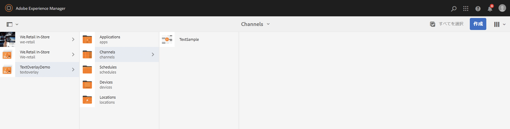
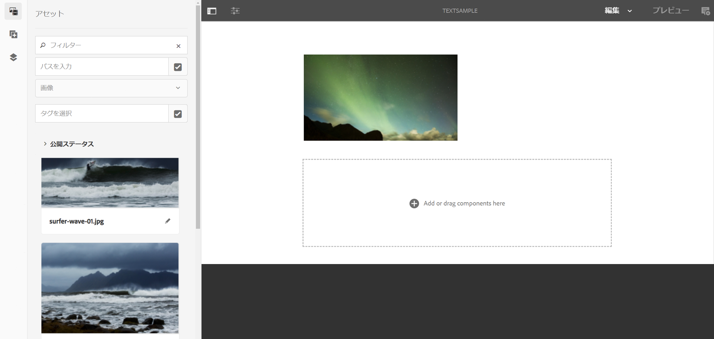

# テキストオーバーレイ {#text-overlay}

ここでは、以下のトピックについて説明します。

* **概要**
* **テキストオーバーレイの使用**
* **テキストオーバーレイのプロパティについて**
* **テキストオーバーレイでの ContextHub 値の使用**

>[!CAUTION]
>
>**テキストオーバーレイ**&#x200B;機能は、AEM 6.3 機能パック 5 または AEM 6.4 機能パック 3 がインストールされている場合にのみ使用できます。

## 概要 {#overview}

テキストオーバーレイは AEM Screens で利用できる機能で、画像の上にタイトルや説明を重ねて表示することにより、シーケンスチャネルに魅力的なエクスペリエンスを作成できます。

独自のカスタムコンポーネントの作成方法については、**AEM Screens コンポーネントの拡張**&#x200B;を参照してください。

この節では、ポスターコンポーネントを AEM Screens プロジェクトのシーケンスチャネルの 1 つでテキストオーバーレイとして使用する方法のみ紹介します。

## テキストオーバーレイの使用 {#using-text-overlay}

この節では、AEM Screens プロジェクトでのテキストオーバーレイの使用について説明します。

**前提条件**

テキストオーバーレイ機能の実装を開始する前に、前提条件として、プロジェクトをセットアップしておく必要があります。例：

* AEM Screens プロジェクト（この例では **TextOverlayDemo**）を作成する

* **チャネル**&#x200B;フォルダーの下に **TextSample** というシーケンスチャネルを作成します

* **TextSample** チャネルにコンテンツを追加する

次の画像は、**チャネル**&#x200B;フォルダーに **TextSample** チャネルがある **TextOverlayDemo** プロジェクトを示しています。

次の手順に従って、AEM Screens チャネルでテキストオーバーレイを使用します。

1. **TextOverlayDemo**／**Channels**／**TextSample** に移動し、アクションバーの「**編集**」をクリックして、エディターを開きます。

   

1. 画像を選択し、**設定**（レンチ）アイコンをクリックして、プロパティダイアログボックスを開きます。

   

1. ダイアログボックスのナビゲーションバーから「**テキストオーバーレイ**」オプションを選択します（下図を参照）。

   

### テキストオーバーレイのプロパティについて {#understanding-text-overlay-properties}

「テキストオーバーレイ」タブのプロパティを使用すると、Screens プロジェクトの任意のコンポーネントにテキストを追加できます。この節では、「テキストオーバーレイ」タブで使用できるプロパティの概要を説明します。

テキストボックスにテキストを追加し、太字、斜体、下線などの強調書式を追加できます。

**カラーバリアント**：このオプションを選択すると、テキストは「暗い色」（黒のテキスト）または「明るい色」（白のテキスト）になります。

**サイズと位置の設定**：テキストを水平または垂直方向に揃えることができます。さらに、詳細設定ツールを使用してテキストの位置揃えをおこなうこともできます。

>[!NOTE]
>
>詳細設定ツールを適切に使用するには、「px」をサフィックスとして使用して、正しい位置をピクセル単位で指定する必要があります。例えば、「200px」とすると、開始点から 200 ピクセル離れた位置が指定されます。

## テキストオーバーレイでの ContextHub 値の使用 {#using-text-overlay-context-hub}

次の節では、データストアの値の使用方法について説明します。例えば、テキストオーバーレイコンポーネントの Google シートなどです。

**前提条件**

AEM Screens プロジェクトの ContextHub 構成を設定する必要があります。

データストアを使用してデータ駆動型アセットの変更を設定および管理する方法については、「[AEM Screens での ContextHub の設定](https://docs.adobe.com/content/help/ja-JP/experience-manager-screens/user-guide/developing/configuring-context-hub.html)」を参照してください。

プロジェクトに必要な設定をおこなったら、次の手順に従って Google シートの値を使用します。

1. **TextOverlayDemo**／**チャネル**／**TextSample** に移動して、アクションバーから「**プロパティ**」をクリックします。

1. 「**パーソナライズ機能**」タブを選択して、ContextHub 設定をセットアップします。

   1. 「**ContextHub のパス**」として **libs**/**settings**/**cloudsettings**/**default**/**ContextHub Configurations** を選択し、「**選択**」をクリックします。

   1. 「**セグメントのパス**」として **conf**／**Screens**／**settings**／**wcm**／**segments** を選択し、「**選択**」をクリックします。

   1. 「**保存して閉じる**」をクリックします。

      >[!NOTE]
      >
      >ContextHub 設定とセグメントをそれぞれ最初に保存した、Context Hub とセグメントのパスを使用します。

      

1. **TextOverlayDemo**／**Channels**／**TextSample** に移動し、アクションバーの「**編集**」をクリックして、エディターを開きます。

   

1. 「[テキストオーバーレイの使用](/help/user-guide/text-overlay.md#using-text-overlay)」の節で説明されているように、画像とテキストオーバーレイコンポーネントを画像に追加します。

1. 「**構成**」（レンチアイコン）をクリックして、「**画像**」ダイアログボックスを開きます。

   

1. **画像**&#x200B;ダイアログボックスから「**ContextHub**」タブに移動します。「**追加**」をクリックします。

   >[!NOTE]
   >ContextHub 構成を設定していない場合、このオプションはプロジェクトで無効になります。

1. 「**プレースホルダー**」フィールドに&#x200B;**値**&#x200B;を入力し、Google スプレッドシートから値を取得する行を選択して **ContextHub 変数**（この場合、値は Google スプレッドシートの行 2 列 1 から取得されます）に入力します。**デフォルト値**&#x200B;を **20** として入力します（下の図参照）。完了したら、チェックマークをクリックします。

   

   >[!NOTE]
   >参照用に、次の図は Google シートから取得される値を示しています。

   

1. 次の図に示すように、画像ダイアログボックスから&#x200B;**テキストオーバーレイ**&#x200B;タブに戻り、「*Current Temperature {Value}*」というテキストを追加します。

   

1. 「**プレビュー**」をクリックし、出力を表示します。

   
