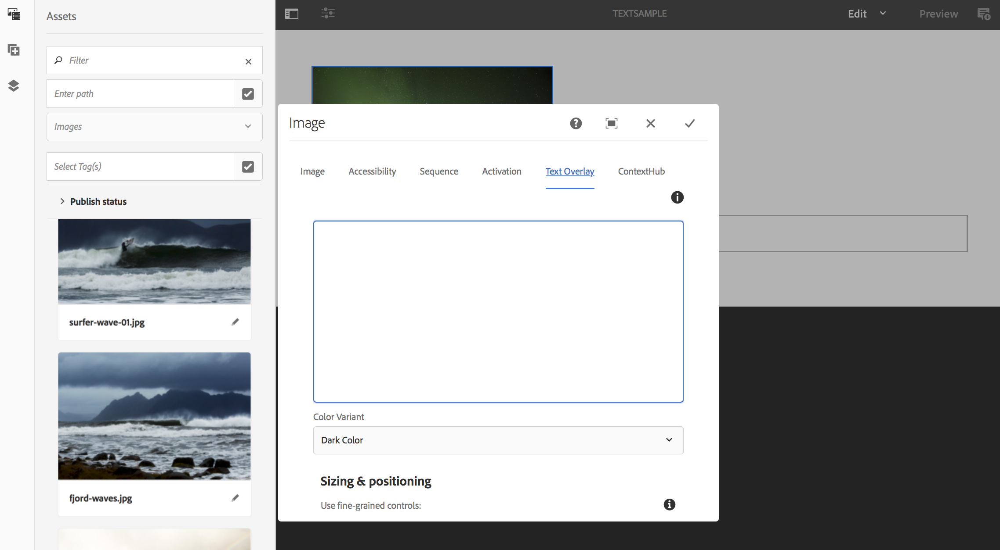

# テキストオーバーレイ {#text-overlay}

この節では、以下のトピックについて説明します。

* **概要**
* **テキストオーバーレイの使用**
* **前提条件**
* **テキストオーバーレイのプロパティについて**

>[!CAUTION]
>
>テキ **ストオーバーレイ機能は** 、AEM 6.3 Feature Pack 5またはAEM 6.4 Feature Pack 3をインストールしている場合にのみ使用できます。

## 概要 {#overview}

テキストオーバーレイは、AEM Screensで使用できる機能で、画像の上に重ねて表示されるタイトルや説明を指定することで、シーケンスチャネル内に説得力のあるエクスペリエンスを作成できます。

独自のカスタムコンポーネントの作成方法については、「AEM Screensコンポーネントの拡 **張」を参照してください**。

この節では、AEM Screensプロジェクトでポスターコンポーネントを使用し、そのポスターコンポーネントを使用して、シーケンスチャネルの1つのテキストオーバーレイとして使用する方法についてのみ説明します。

## テキストオーバーレイの使用 {#using-text-overlay}

次の節では、AEM Screensプロジェクトでのテキストオーバーレイの使用について説明します。

### 前提条件 {#prerequisites}

この機能の実装を開始する前に、テキストオーバーレイの実装を開始する前提条件としてプロジェクトが設定されていることを確認してください。 以下に例を挙げます。  

* AEM Screensプロジェクトの作成(この例では、 **TextOverlayDemo**)

* Channelsフォルダーの下にTextSampleと **してチャネ** ルを作成 ****

* TextSampleチャネルへのコンテ **ンツの追加**

次の画像は、 **Channelsフォルダー内のTextSample** channelを持つTextOverlayDemoプロジェクト **を示しています****** 。

1. TextOverlayDemo **—&gt;** Channels **/** TextSample **— に移動し、アクションバーから****** 「EditEdit」をクリックしてエディターを開きます。

   

1. 画像を選択し、「設定」 **** （レンチアイコン）をクリックして、プロパティダイアログボックスを開きます。

   

1. 次の図に示すよ **うに** 、ダイアログボックスのナビゲーションバーから「テキストオーバーレイ」オプションを選択します。

   

### テキストオーバーレイのプロパティについて {#understanding-text-overlay-properties}

「テキストオーバーレイ」プロパティを使用して、画面プロジェクトの任意のコンポーネントにテキストを追加できます。 次の節では、テキストオーバーレイで使用できるプロパティの概要を説明します。

テキストボックスにテキストを追加し、太字、斜体、下線などのテキスト強調を追加できます。

**[色バリアント** ]このオプションを選択すると、テキストは暗い色（黒のテキスト）または明るい色（白のテキスト）になります。

**[サイズと位置** ]このオプションを使用すると、テキストを水平または垂直に揃えたり、さらに詳細なツールを使用してテキストの位置揃えを行うことができます。

>[!NOTE]
>
>きめの細かいツールを適切に使用するには、(px)をサフィックスとして使用し、200pxのように正しい位置をピクセルで識別する必要があります。 この式の結果は、始点から200ピクセルになります。

