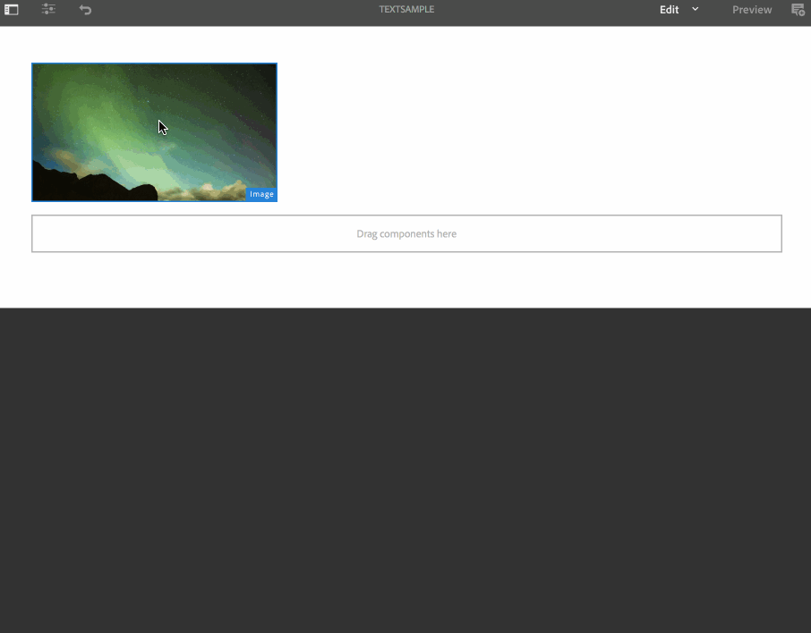

# テキストオーバーレイ {#text-overlay}

ここでは、以下のトピックについて説明します。

* **概要**
* **テキストオーバーレイの使用**
* **テキストオーバーレイのプロパティについて**
* **テキストオーバーレイでの ContextHub 値の使用**

>[!CAUTION]
>
>**テキストオーバーレイ**&#x200B;機能は、AEM 6.3 機能パック 5 または AEM 6.4 機能パック 3 がインストールされている場合にのみ使用できます。

## 概要 {#overview}

テキストオーバーレイは、AEM Screensで利用できる機能です。画像の上に重ねて表示されるタイトルや説明を指定してシーケンスチャネルで魅力的なエクスペリエンスを作成することができます。

独自のカスタムコンポーネントの作成方法については、**AEM Screens コンポーネントの拡張**&#x200B;を参照してください。

この節では、AEM Screens プロジェクトでポスターコンポーネントを使用および適用する方法のみを示します。また、シーケンスチャネルの 1 つでテキストオーバーレイとして使用する方法も紹介します。

## テキストオーバーレイの使用 {#using-text-overlay}

この節では、AEM Screens プロジェクトでのテキストオーバーレイの使用について説明します。

**前提条件**

この機能を実装する前に、テキストオーバーレイの実装を開始するための前提条件として、プロジェクトをセットアップしておく必要があります。次に例を示します。

* AEM Screens プロジェクト（この例では **TextOverlayDemo**）を作成する

* **チャネル**&#x200B;フォルダーの下に **TextSample** というタイトルのシーケンスチャネルを作成します

* **TextSample** チャネルにコンテンツを追加する

次の画像は、**Channels** フォルダーに **TextSample** チャネルがある **TextOverlayDemo** プロジェクトを示しています。

次の手順に従って、AEM Screens チャネルでテキストオーバーレイを使用します。

1. **TextOverlayDemo**／**チャネル**／**TextSample** に移動して、アクションバーから「**編集**」をクリックします。

   

1. 画像をクリックし、**設定**（レンチのアイコン）をクリックして、プロパティダイアログボックスを開きます。

   

1. ダイアログボックスのナビゲーションバーから「**テキストオーバーレイ**」オプションをクリックします（下図を参照）。

   

### テキストオーバーレイのプロパティについて {#understanding-text-overlay-properties}

テキストオーバーレイのプロパティを使用すると、Screens プロジェクトの任意のコンポーネントにテキストを追加できます。この節では、「テキストオーバーレイ」タブで使用できるプロパティの概要を説明します。

テキストボックスにテキストを追加し、太字、斜体、下線など、書式に強調を追加できます。

**カラーバリアント**：このオプションを選択すると、テキストは「暗い色」（黒のテキスト）または「明るい色」（白のテキスト）になります。

**サイズと位置の設定**&#x200B;このオプションで、テキストを水平または垂直方向に揃えることができます。または、テキストの位置揃えには詳細設定ツールを使用します。

>[!NOTE]
>
>詳細設定ツールを適切に使用するには、「px」をサフィックスとして使用して、正しい位置をピクセル単位で指定する必要があります（例：200 px）。この式の結果は、開始点から 200 ピクセルになります。

## テキストオーバーレイでの ContextHub 値の使用 {#using-text-overlay-context-hub}

次の節では、データストアの値の使用方法について説明します（例：テキストオーバーレイコンポーネントの Google スプレッドシート）。

**前提条件**

AEM Screens プロジェクトの ContextHub 設定を設定します。

データストアを使用してデータ駆動型アセットの変更を設定および管理する方法については、[AEM Screens での ContextHub の設定](https://experienceleague.adobe.com/ja/docs/experience-manager-screens/user-guide/developing/configuring-context-hub)を参照してください。

プロジェクトに必要な設定を行ったら、次の手順に従って Google Sheets の値を使用します。

1. **TextOverlayDemo**／**Channels**／**TextSample** に移動して、アクションバーから「**プロパティ**」をクリックします。

1. 「**パーソナライズ機能**」タブをクリックすると、ContextHub 設定をセットアップできます。

   1. **libs**／**settings**／**cloudsettings**／**default**／**ContextHub Configurations** のとおりに **ContextHub のパス** をクリックし、「**選択**」をクリックします。

   1. **conf**／**screens**／**settings**／**wcm**／**segments** のとおりに **セグメントのパス** をクリックし、「**選択**」をクリックします。

   1. 「**保存して閉じる**」をクリックします。

      >[!NOTE]
      >
      >ContextHub 設定とセグメントを最初に保存した場所で、Context Hub とセグメントのパスを使用します。

      

1. **TextOverlayDemo**／**チャネル**／**TextSample** に移動して、アクションバーから「**編集**」をクリックします。

   

1. 「[テキストオーバーレイの使用](/help/user-guide/text-overlay.md#using-text-overlay)」の節で説明されているように、画像とテキストオーバーレイコンポーネントを画像に追加します。

1. 「**構成**」（レンチアイコン）をクリックして、「**画像**」ダイアログボックスを開きます。

   

1. **画像**&#x200B;ダイアログボックスから「**ContextHub**」タブに移動します。「**追加**」をクリックします。

   >[!NOTE]
   >ContextHub 設定を行っていない場合、このオプションはプロジェクトで無効になります。

1. **プレースホルダー**&#x200B;フィールドに&#x200B;**値**&#x200B;を入力します。**ContextHub 変数**&#x200B;で、Google スプレッドシートから値を取得する行をクリックします。この場合、値は Google Sheets の行 2 と列 1 から取得されます。次の図に示すように、**デフォルト値**&#x200B;を **20** と入力します。完了したら、チェックマークをクリックします。

   

   >[!NOTE]
   >参照用に、次の図は Google Sheets から取得される値を示しています。

   

1. 次の図に示すように、画像ダイアログボックスから&#x200B;**テキストオーバーレイ**&#x200B;タブに戻り、「*Current Temperature {Value}*」というテキストを追加します。

   

1. **プレビュー**&#x200B;をクリックします。

   
