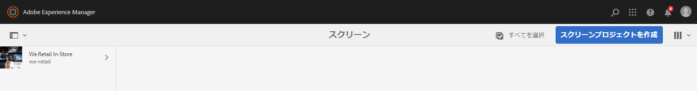
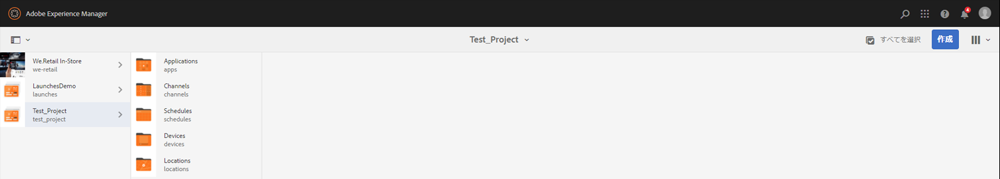
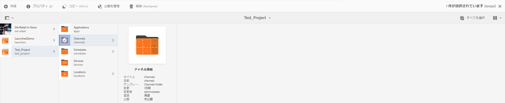
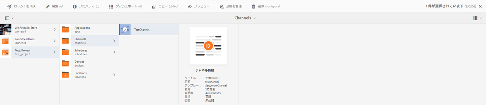

# ビデオ再生の設定とトラブルシューティング {#video-playback-configuration-and-troubleshooting}

ビデオを DAM にアップロードしてチャネルに追加するときに、ビデオが Screens Player で再生されないという問題が発生する場合があります。

以下の節では、チャネルで再生されるビデオをデバッグおよびトラブルシューティングする方法について説明します。

## DAM レンディション    {#dam-renditions}

ビデオをチャネルにアップロードすると、AEM によってそのビデオの一部のレンディションの作成が開始されます。ビデオは Assets で表示できます。

ビデオを表示するには：

1. ビデオ（例：`http://localhost:4502/assets.html/content/dam/we-retail/en/videos`）に移動します。
1. ビデオをクリックし、左上のメニューを展開して「**レンディション**」をクリックします。

様々なレンディションがあります（MP4 や M4V など）。

レンディションがない場合は、AEM が動作している OS に ffmpeg がインストールされていることを確認してください。

>[!CAUTION]
>
>レンディションがない場合は、AEM が動作している OS に ffmpeg がインストールされていることを確認してください。
>
>ffmpeg をインストールするには、[ここ](https://www.ffmpeg.org/download.html)をクリックしてください。

## ビデオアセット {#video-assets}

ビデオの下にソース属性が表示されない場合は、ビデオがトランスコードされなかった可能性があります。ビデオが正しくトランスコードされている場合は、次の図に示すようにダッシュボードに表示されます。

ffmpeg がインストールされていること、およびビデオプロファイルを確認してください。

### ビデオプロファイルの確認 {#checking-video-profile}

1. **ビデオプロファイル**（`http://localhost:4502/etc/dam/video.html`）に移動し、「**テストビデオをアップロード**」をクリックします。

   

1. テストビデオをアップロードし、「**OK**」をクリックしてトランスコードを開始します。

   トランスコードが失敗した場合は、ffmpeg 出力を展開して ffmpeg のコンソール出力でエラーを確認します。

   

   また、ビデオが正常にトランスコードされた場合は、トランスコードされたファイルをダウンロードできます。

   

   >[!NOTE]
   >
   >ビデオのトランスコードに十分な時間をかけてから（「処理しています」ではなく「新規」というタグが表示されます）、ビデオをチャネルに追加するようにしてください。

### ビデオコンポーネントでのプロファイルの確認    {#checking-profile-with-a-video-component}

ビデオコンポーネントが正しく設定されない場合は、ページデザインからプロファイルのリストを確認します。

1. チャネルに移動し、**デザイン**&#x200B;モードを選択します。

   

1. ビデオを選択し、**編集**&#x200B;ダイアログを開きます。「**プロファイル**」タブを開きます。

   >[!NOTE]
   >様々なプロファイルを選択します（少なくとも「高画質 H.264」プロファイルは必ずあります）。

### Web プレーヤーでのビデオの確認 {#checking-the-video-in-the-web-player}

**Web プレーヤー**（`http://localhost:4502/content/mobileapps/cq-screens-player/firmware.html/content/screens/we-retail/locations/demo/flagship/single/device0`）を使用して、ブラウザー（Chrome および Safari）で再生を検証します。Chrome は Android デバイスで使用され、Safari は OSX および iOS のブラウザーです。

Safari で実行されない場合、ビデオは OSX および iOS のプレーヤーで実行されません。これはエンコーディングの問題である可能性が高く、ビデオを再度エンコードする必要があります。

DAM ワークフローを使用してフル HD レンディションを作成するには、次の手順を実行します。

1. *ワークフローモデル管理*（`http://localhost:4502/libs/cq/workflow/admin/console/content/models.html/etc/workflow/models`）に移動します。
1. **スクリーン更新アセット**&#x200B;モデルを選択します。
1. アクションバーから「**ワークフローを開始**」をクリックして、**ワークフローを実行**&#x200B;ダイアログボックスを開きます。

1. 「**ペイロード**」でビデオアセットを選択します。
1. 「**実行**」をクリックします。

>[!NOTE]
>
>レンディションの作成には多少時間がかかりますが、数秒または数分後（ビデオサイズによります）、Safari で Web プレーヤーを再読み込みします。

#### 自動再生ポリシーフラグのトラブルシューティング {#troubleshooting-autoplay-policy-flag}

AEM Screens プレーヤーでビデオを取得してもビデオが表示されない場合は、自動再生ポリシーフラグのトラブルシューティングをおこなう必要があります。

Google の自動再生ポリシーフラグに関する問題をトラブルシューティングするには、以下の手順に従います。

1. ***chrome://flags/#autoplay-policy*** に移動します。
1. 「**Autoplay policy**」を「**Default**」から「**No user gesture is required**」に変更します。

1. Web ブラウザーを再起動し、プレーヤーを更新します。

>[!NOTE]
>
>Chrome の新しい自動再生ポリシーを適切に操作するためのベストプラクティスについて詳しくは、*自動再生ポリシーの変更に関するドキュメント*（`https://developers.google.com/web/updates/2017/09/autoplay-policy-changes#webaudio`）を参照してください。

### 複数のプレーヤーでのビデオの同期 {#syncing-video-across-multiple-players}

複数のデバイスで同期的にビデオを再生するには、そのビデオが含まれているシーケンスに関して絶対方法を使用する必要があります。

#### 要件 {#requirements}

* 同一の 2 台以上のプレーヤー
* 理想的には同種のハードウェア
* 同一のネットワークトポロジ（プレーヤーは、内部システムクロックを揃える NTP サーバーに接続されます）

#### 絶対方法の設定 {#setting-up-the-absolute-strategy}

絶対方法：

* アンカー時間（現在の日付の 0 時）を計算します。
* シーケンスの期間（すべての項目の期間の合計）を計算します。
* 任意の時点で、シーケンスの _remaining_time = (current_time - anchor_time) % sequence_duration を求めることによって、現在再生されている項目および次の項目を計算します。

絶対方法を設定するには、次の手順を実行します。

1. チャネルオーサーに移動し、次の図に示すようにシーケンスコンポーネントを選択します。
1. その設定ダイアログを開きます。
1. 「**方法**」を編集し、「絶対」を追加します。

   

   >[!NOTE]
   >プレーヤーの OS のクロックが同一である必要があります。

**OS X でクロックを揃える**：OS X でクロックを揃えるには、以下の手順に従います。

1. 各 OSX ボックスで、**日付と時刻**&#x200B;環境設定を開きます。
1. 「**日付と時刻を自動的に設定**」をオンにします。
1. ドロップダウンの値 0.pool.ntp.org、1.pool.ntp.org、2.pool.ntp.org、3.pool.ntp.org、time.apple.com を貼り付けるか、単に *sudo ntpdate -u -v 0.pool.ntp.org* を実行します。
1. 2 台以上のプレーヤーを起動します。

プレーヤーが新しく割り当てられたシーケンスを開始するまでに時間がかかることがあります。

