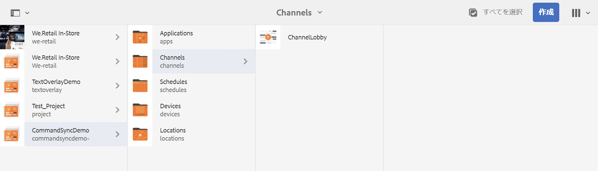
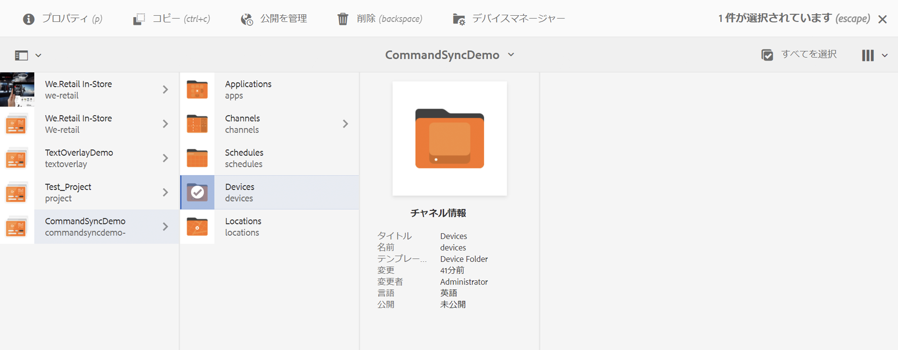
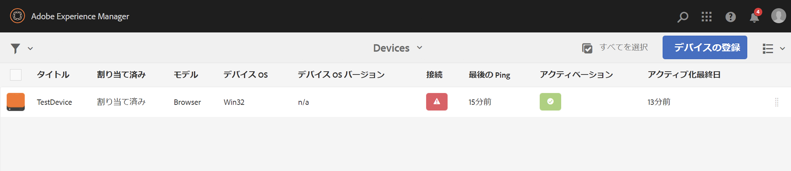
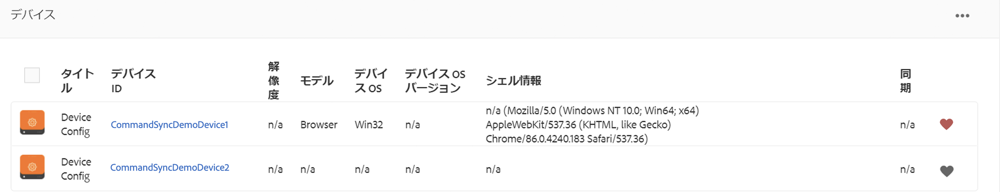
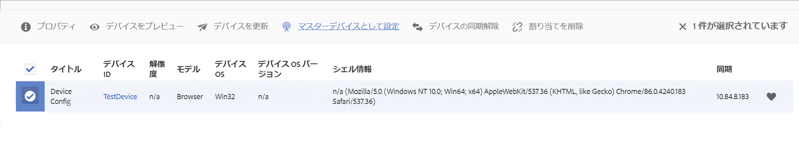
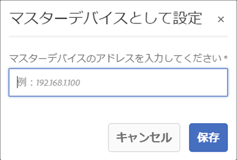
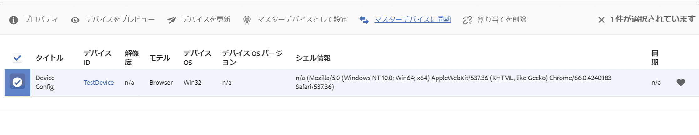
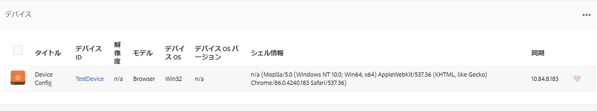
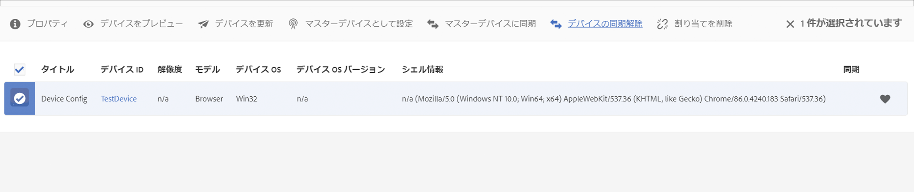

# コマンド同期 {#command-sync}

以下では、コマンド同期の使用方法について説明します。コマンド同期を使用すると、異なるプレーヤー間で再生を同期できます。 プレーヤーは異なるコンテンツを再生できますが、各アセットの再生時間は同じにする必要があります。

## 概要 {#overview}

デジタル署名ソリューションは、新年のカウントダウンや大きなビデオのスライスによる複数の画面での再生などのシナリオをサポートするために、ビデオウォールと同期再生をサポートする必要があります。ここでコマンド同期が実行されます。

To use Command Sync, one player acts as a *master* and sends command and all the other players act as *clients* and play when they receive the command.

*マスター*&#x200B;は、コンテンツ項目の再生を開始しようとするときに、登録済みのすべてのクライアントにコマンドを送信します。再生するコンテンツ項目のインデックスや再生する要素の外部 HTML が、このコマンドのペイロードになります。

## コマンド同期の実装 {#using-command-sync}

次の節では、AEM Screensプロジェクトでコマンド同期を使用する方法について説明します。

### プロジェクトのセットアップ {#setting-up}

コマンド同期機能を使用する前に、プロジェクトと、プロジェクト用にコンテンツが設定されたチャネルがあることを確認してください。

1. 次の例は、**CommandSyncDemo** という名前のデモプロジェクトと、シーケンスチャネル **ChannelLobby** を示しています。

   

   >[!NOTE]
   >
   >チャネルを作成する方法、またはチャネルにコンテンツを追加する方法については、[チャネルの作成と管理](/help/user-guide/managing-channels.md)を参照してください。

   下の図に示すように、チャネルには次のコンテンツが含まれます。

   

1. 下の図に示すように、**ロケーション**フォルダーにディスプレイを作成します。
   

1. チャネル **ChannelLobby** を **LobbyDisplay** に割り当てます。
   

   >[!NOTE]
   >
   >ディスプレイにチャネルを割り当てる方法については、[ディスプレイの作成と管理](/help/user-guide/managing-displays.md)を参照してください。。

1. **デバイス**&#x200B;フォルダーに移動し、アクションバーの「**デバイスマネージャー**」をクリックしてデバイスを登録します。

   

   >[!NOTE]
   >
   >ディスプレイにチャネルを割り当てる方法については、[ディスプレイの作成と管理](/help/user-guide/managing-displays.md)を参照してください。

1. この例では、ChromeデバイスとWindowsプレーヤーを2つの異なるデバイスとして表示します。 両方のデバイスが同じディスプレイを指しています。
   

### チャネル設定の更新

1. ChannelLobbyに移動し、アク **ションバ** ーで **** 「編集」をクリックして、チャネル設定を更新します。

1. 下の図に示すように、チャネル全体を選択します。
   

1. レンチアイコンをクリックして、ページ **ダイアログ** ボックスを開きます。
   

1. 「戦略」フィ *ールドに* 、同期したキーワード **を入力します** 。

   

### マスターの設定{#setting-up-master}

1. **CommandSyncDemo**／**Locations**／**Lobby**／**LobbyDisplay** でディスプレイダッシュボードに移動し、アクションバーの「**ダッシュボード**」をクリックします。
You will see the two devices (chrome and windows player) in **DEVICES** panel, as shown in the figure below.
   

1. **デバイス**&#x200B;パネルから、マスターとして設定するデバイスを選択します。次の例は、Chrome デバイスをマスターとして設定する方法を示しています。「**マスターデバイスとして設定**」をクリックします。

   

1. 「**マスターデバイスとして設定**」に IP アドレスを入力し、「**保存**」をクリックします。

   

>[!NOTE]
> 複数のデバイスをマスターとして設定できます。

### マスターとの同期 {#sync-up-master}

1. Chromeデバイスをマスターとして設定したら、他のデバイス（この場合はWindows Player）を同期してマスターと同期できます。
Select the other device (in this case, windows player) from the **DEVICES** panel and click on **Sync to master device**, as shown in the figure below.

   

1. リストからデバイスを選択し、「**保存**」をクリックします。

   >[注意:]
   > 「 **Sync to master device** 」ダイアログに、マスター・デバイスのリストが表示されます。 必要な設定を選択できます。

1. デバイス(Windows Player)がマスター(Chrome Player)と同期されると、同期されたデバイスが **DEVICES** パネルに表示されます。

   

### マスターとの同期解除 {#desync-up-master}

デバイスをマスターに同期した後は、そのデバイスから割り当てを非同期にできます。 マスターデバイスから同期を削除するには、次の手順に従います。

1. 「 **DEVICES** 」パネルに移動し、デバイスを選択します。

1. 「 **Desync device(s)」をクリックして** 、マスター・デバイスからクライアントを同期します。

   

1. 「 **Confirm** 」をクリックして、選択したデバイスをマスターから非同期にします。

   >[注意:]
   > マスター・デバイスを選択して「Desync」オプションを使用すると、マスターに接続されているすべてのデバイスは、1回の手順で同期が解除されます。
