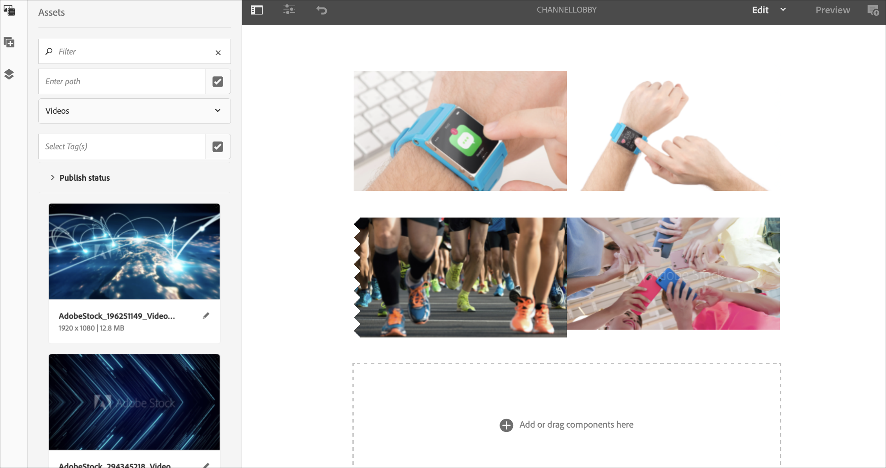
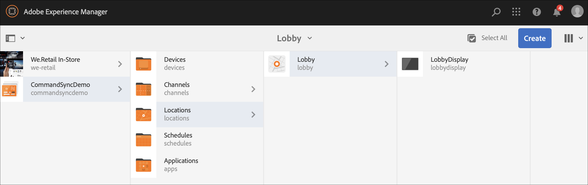
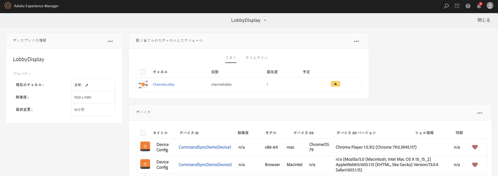
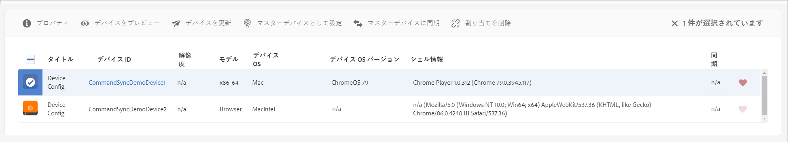

# コマンド同期 {#command-sync}

以下では、コマンド同期の使用方法について説明します。コマンド同期を使用すると、異なるプレーヤー間で再生を同期できます。 プレーヤーは異なるコンテンツを再生できますが、各アセットの再生時間は同じにする必要があります。

## 概要 {#overview}

デジタル署名ソリューションは、新年のカウントダウンや大きなビデオのスライスによる複数の画面での再生などのシナリオをサポートするために、ビデオウォールと同期再生をサポートする必要があります。ここでコマンド同期が実行されます。

To use Command Sync, one player acts as a *master* and sends command and all the other players act as *clients* and play when they receive the command.

*マスター*&#x200B;は、コンテンツ項目の再生を開始しようとするときに、登録済みのすべてのクライアントにコマンドを送信します。再生するコンテンツ項目のインデックスや再生する要素の外部 HTML が、このコマンドのペイロードになります。

## コマンド同期の実装 {#using-command-sync}

次の節では、AEM Screensプロジェクトでコマンド同期を使用する方法について説明します。

### プロジェクトのセットアップ {#setting-up}

コマンド同期機能を使用する前に、プロジェクトと、コンテンツが設定されたチャネルがプロジェクトにあることを確認してください。

1. 次の例は、 **CommandSyncDemoという名前のデモプロジェクトと** 、シーケンスchannelChannelLobbyを示して **います**。

   

   >[!NOTE]
   >
   >チャネルを作成する方法、またはチャネルにコンテンツを追加する方法については、「チャネルの作成と管理」 [を参照してください。](/help/user-guide/managing-channels.md)

   チャネルには、次の図に示すように、次のコンテンツが含まれます。

   

1. 下の図に示すように、 **Locations** （場所）フォルダーに表示を作成します。
   

1. チャネルChannelLobbyを **LobbyDisplay** に割り当 **てます**。
   

   >[!NOTE]
   >
   >To learn how to assign a channel to a display, refer to [Creating and Managing Displays](/help/user-guide/managing-displays.md)

1. 「 **Devices** 」フォルダに移動し、アクシ **ョンバーの「Device Manager** 」をクリックしてデバイスを登録します。

   

   >[!NOTE]
   >
   >To learn how to assign a channel to a display, refer to [Creating and Managing Displays](/help/user-guide/managing-displays.md)

1. デモ用に、この例では、ChromeデバイスとWebプレーヤーを2つの異なるデバイスとして表示します。 両方のデバイスが同じディスプレイを指しています。
   

### Setting up a Master {#setting-up-master}

1. CommandSyncLoby **—>** Locations **—>** Loby **—>** Lobby **Lobby** DisplayDashboard Display Dashboard Demo **Demo** CommandSyncLocations —> Locations —> Lopations から表示ダッシュボードに移動します。
次の図に示すように、 **DEVICES** （デバイス）パネルに2つのデバイス（ChromeとWindows Player）が表示されます。

   

1. 「 **DEVICES** 」パネルから、マスターとして設定するデバイスを選択します。 次の例は、Chromeデバイスをマスターとして設定する方法を示しています。 「 **Set as master device**」をクリックします。

   

1. 「 **Set as master device** 」にIPアドレスを入力し、「 **Save」をクリックします**。

   

### マスターとの同期 {#sync-up-master}

1. Chromeデバイスをマスターとして設定したら、他のデバイスを同期してマスターと同期できます。
次の図に示すように、 **DEVICES** （デバイス）パネルから別のデバイスを選択し、「 **Sync to master device**（マスターデバイスと同期）」をクリックします。

1. リストからデバイスを選択し、「保存」をクリッ **クします**。

1. Navigate to the [Web Player](http://localhost:4502/screens/player.html).

