# コマンド同期 {#command-sync}

>[!IMPORTANT]
>このコンテンツは、AEM オンプレミス/AMS （AEM 6.5LTSおよびAEM 6.5）に対して有効です。 AEM as a Cloud Service Screensの内容については、[AEM as a Cloud Service ガイド &#x200B;](https://experienceleague.adobe.com/ja/docs/experience-manager-cloud-service/content/screens-as-cloud-service/overview/introduction)を参照してください。

以下では、コマンド同期の使用方法について説明します。 コマンド同期を使用すると、異なるプレーヤー間で再生を同期させることができます。 プレーヤーごとに異なるコンテンツを再生できますが、各アセットの再生時間は同じにする必要があります。

>[!IMPORTANT]
>
>この機能は、埋め込みシーケンス、動的埋め込みシーケンス、アプリケーションチャネル、トランジションをサポートしていません。

## 概要 {#overview}

デジタルサイネージソリューションでは、ビデオウォールと同期再生をサポートする必要があります。 このシナリオは、新年のカウントダウンや大きなビデオを分割して複数の画面で再生するようなシナリオをサポートしようとする場合に当てはまります。 このようなシナリオでは、コマンド同期が役立ちます。

コマンド同期を使用するには、1 つのプレーヤーが&#x200B;*プライマリ*&#x200B;として機能し、コマンドを送信します。他のすべてのプレーヤーは&#x200B;*クライアント*&#x200B;として機能し、コマンドを受信したときにコンテンツを再生します。

*プライマリ*&#x200B;は、コンテンツ項目の再生を開始しようとするときに、登録済みのすべてのクライアントにコマンドを送信します。 再生する項目のインデックスや再生する要素の外部 HTML、あるいはその両方が、このアクションのペイロードになります。

## コマンド同期の実装 {#using-command-sync}

次の節では、AEM Screens プロジェクトでコマンド同期を使用する方法について説明します。

>[!NOTE]
>
>同期再生をおこなうには、すべてのハードウェアデバイスのハードウェア仕様が同じ（できればオペレーティングシステムも同じ）である必要があります。 異なるハードウェアとオペレーティングシステム間での同期はお勧めしません。

### プロジェクトのセットアップ {#setting-up}

コマンド同期機能を使用する前に、プロジェクトと、プロジェクト用にコンテンツが設定されたチャネルがあることを確認します。

1. 次の例は、**CommandSyncDemo** という名前のデモプロジェクトと、シーケンスチャネル **ChannelLobby** を示しています。

   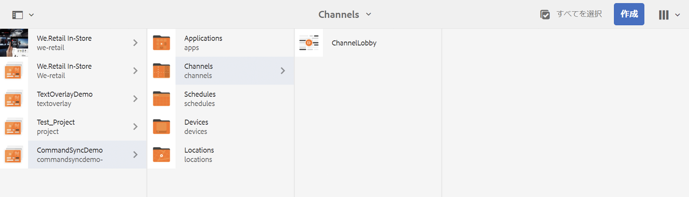

   >[!NOTE]
   >
   >チャネルを作成する方法、またはチャネルにコンテンツを追加する方法については、[チャネルの作成と管理](/help/user-guide/managing-channels.md)を参照してください。

   下の図に示すように、チャネルには次のコンテンツが含まれます。

   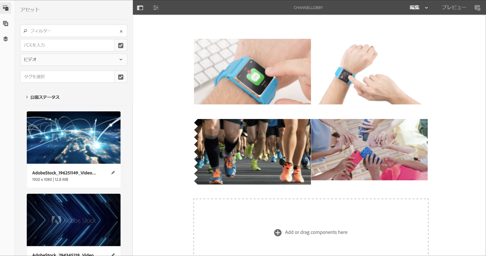

1. 次の図に示すように、**ロビー**&#x200B;というロケーションを作成し、**Locations** フォルダーに **LobbyDisplay** というタイトルのディスプレイを作成します。
   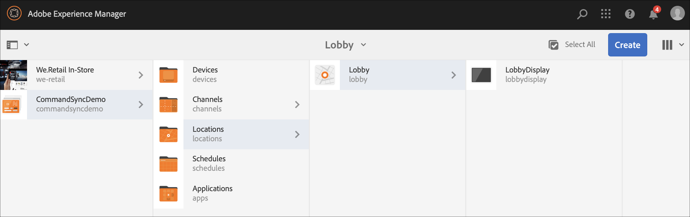

1. チャネル **ChannelLobby**&#x200B;を&#x200B;**LobbyDisplay**&#x200B;に割り当てます。ディスプレイ ダッシュボードから、ディスプレイに割り当てられたチャネルを表示できるようになりました。
   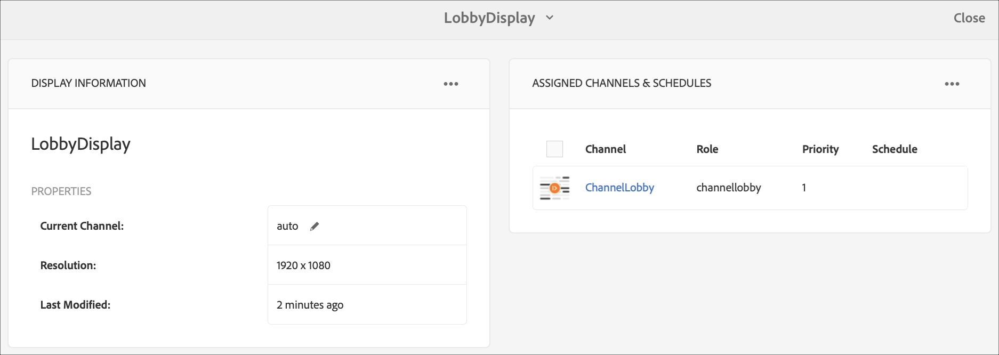

   >[!NOTE]
   >
   >ディスプレイにチャネルを割り当てる方法については、[ディスプレイの作成と管理](/help/user-guide/managing-displays.md)を参照してください

1. **デバイス**&#x200B;フォルダーに移動します。
1. アクションバーの「**デバイスマネージャー**」をクリックします。

   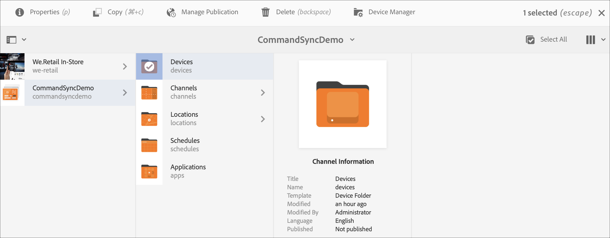

   >[!NOTE]
   >
   >デバイスの登録方法については、[デバイス登録](/help/user-guide/device-registration.md)を参照してください。

1. デモ用に、この例では、Chrome デバイスとWindows Playerを2つの別々のデバイスとして示します。両方のデバイスが同じディスプレイを指しています。
   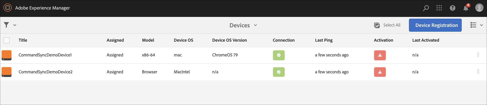

### チャネル設定の更新

1. **ChannelLobby** に移動します。
1. アクションバーの「**編集**」をクリックします。
1. チャネル全体をクリックします（下図を参照）。
   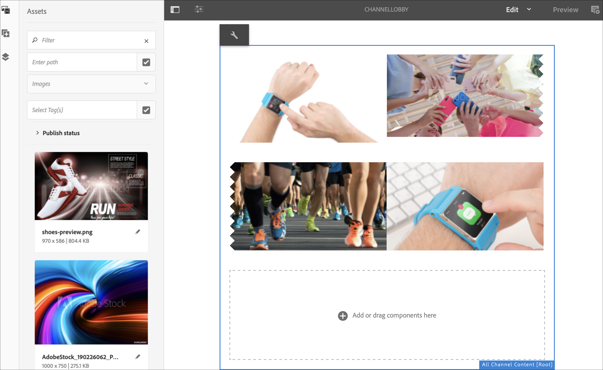

1. レンチアイコンをクリックします。
   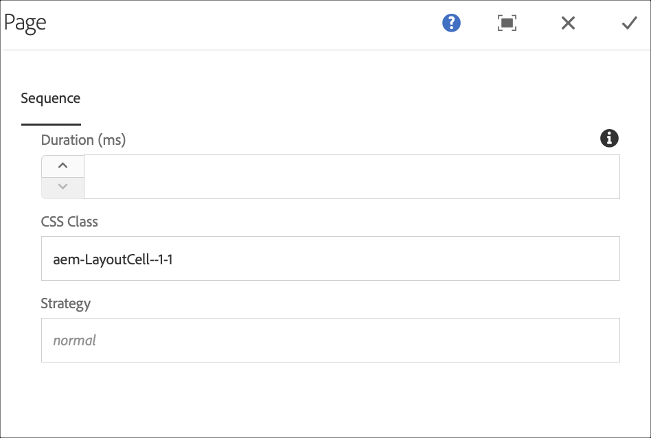

1. **ページ**&#x200B;ダイアログボックスの「**戦略**」フィールドに&#x200B;*同期済み*キーワードを入力します。
   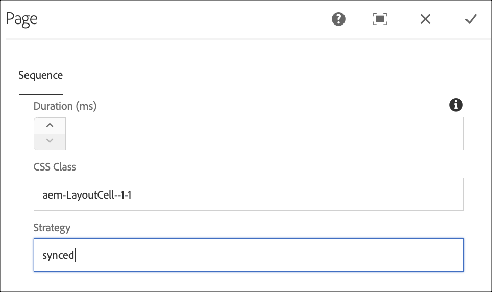

### プライマリの設定 {#setting-up-primary}

1. **CommandSyncDemo** > **Locations** > **Lobby** > **LobbyDisplay**&#x200B;からディスプレイダッシュボードに移動します。次に、アクションバーから「**ダッシュボード**」をクリックします。
**DEVICES** パネルの2つのデバイス（ChromeとWindows Player）に注意してください。次を参照してください。
   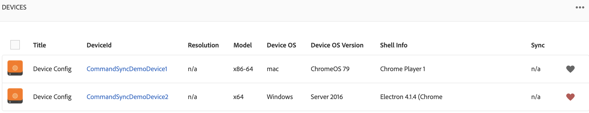

1. **デバイス**&#x200B;パネルから、プライマリとして設定するデバイスをクリックします。 次の例は、Chrome デバイスをプライマリデバイスとして設定する方法を示しています。 「**プライマリデバイスとして設定**」をクリックします。

   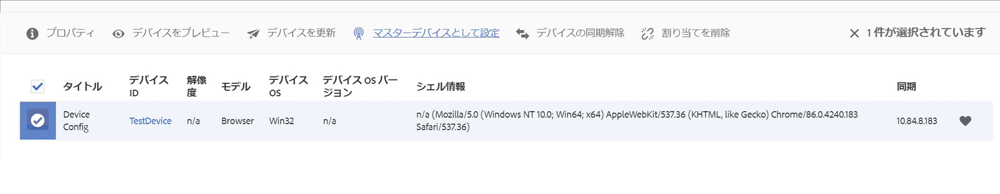

1. **プライマリデバイスとして設定**&#x200B;のフィールドに IP アドレスを入力し、「**保存**」をクリックします。

   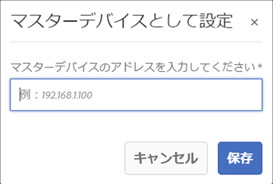

>[!NOTE]
>
>複数のデバイスをプライマリデバイスとして設定できます。

### プライマリとの同期 {#sync-up-primary}

1. Chrome デバイスをプライマリとして設定した後、他のデバイス（この場合はWindows Player）をプライマリと同期させます。
**デバイス** パネルから別のデバイス（この場合はWindows Player）をクリックし、**プライマリデバイス**&#x200B;に同期をクリックします。

   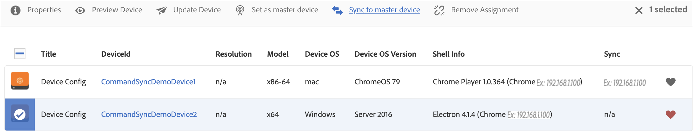

1. リストからデバイスをクリックし、「**保存**」をクリックします。

   >[!NOTE]
   >
   > **プライマリデバイスに同期**&#x200B;ダイアログボックスに、プライマリデバイスのリストが表示されます。 必要な項目を選択します。

1. デバイス（この例では Windows プレーヤー）がプライマリ（この例では Chrome プレーヤー）に同期されると、同期されたデバイスを&#x200B;**デバイス**&#x200B;パネルに表示できます。

   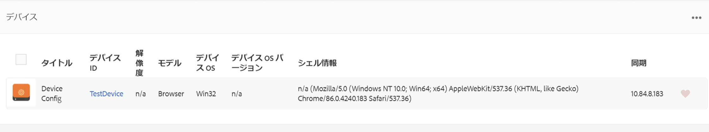

### プライマリとの同期解除 {#desync-up-primary}

1 つ以上のデバイスをプライマリに同期した後は、そのデバイスから同期の割り当てを解除できます。

>[!NOTE]
>
>プライマリデバイスの同期を解除すると、そのプライマリデバイスと関連付けられているすべてのクライアントデバイスのリンクも解除されます。

プライマリデバイスから同期を解除するには、次の手順に従います。

1. **デバイス**&#x200B;パネルに移動し、デバイスをクリックします。

1. 「**デバイスの同期を解除**」をクリックして、プライマリデバイスからクライアントの同期を解除します。

   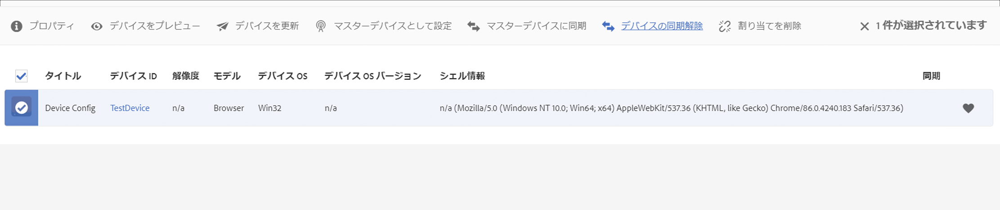

1. 「**確認**」をクリックして、選択したデバイスの同期をプライマリから解除します。

   >[!NOTE]
   >
   > プライマリデバイスをクリックして同期解除オプションを使用すると、プライマリに接続されているすべてのデバイスの同期がワンステップで解除されます。
