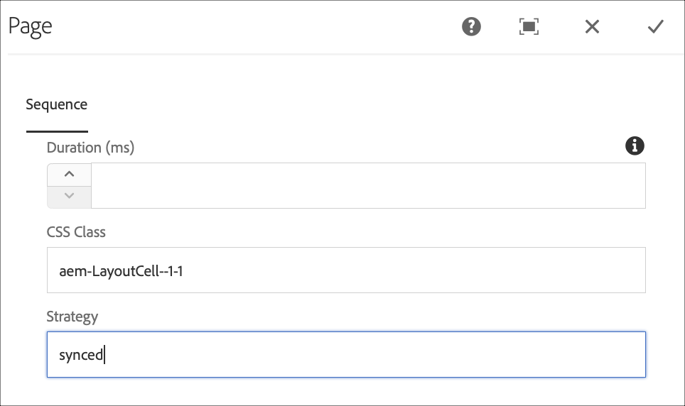

# コマンド同期 {#command-sync}

以下では、コマンド同期の使用方法について説明します。コマンド同期を使用すると、異なるプレーヤー間で再生を同期させることができます。プレーヤーは異なるコンテンツを再生できますが、各アセットのデュレーションは同じである必要があります。

>[!IMPORTANT]
>
>この機能は、埋め込みシーケンス、動的埋め込みシーケンス、アプリケーションチャネル、トランジションをサポートしていません。

## 概要 {#overview}

デジタルサイネージソリューションでは、ビデオウォールと同期再生をサポートする必要があります。 このシナリオは、新年のカウントダウンや大きなビデオを分割して複数の画面で再生するようなシナリオをサポートしようとする場合に当てはまります。 このようなシナリオでは、コマンド同期が利用されます。

コマンド同期を使用するには、1 つのプレーヤーが *プライマリ* コマンドを送信し、他のすべてのプレイヤーは *クライアント* コマンドを受け取ったら再生します。

*プライマリ*&#x200B;は、コンテンツ項目の再生を開始しようとするときに、登録済みのすべてのクライアントにコマンドを送信します。このアクションのペイロードは、再生する項目のインデックス、再生する要素の外部 HTML、またはその両方にすることができます。

## コマンド同期の実装 {#using-command-sync}

次の節では、AEM Screens プロジェクトでコマンド同期を使用する方法について説明します。

>[!NOTE]
>
>同期再生をおこなうには、すべてのハードウェアデバイスのハードウェア仕様が同じ（できればオペレーティングシステムも同じ）である必要があります。異なるハードウェアとオペレーティングシステム間での同期はお勧めしません。

### プロジェクトのセットアップ {#setting-up}

コマンド同期機能を使用する前に、プロジェクトと、プロジェクトのコンテンツを含むチャネルが設定されていることを確認します。

1. 次の例は、**CommandSyncDemo** という名前のデモプロジェクトと、シーケンスチャネル **ChannelLobby** を示しています。

   

   >[!NOTE]
   >
   >チャネルを作成する方法、またはチャネルにコンテンツを追加する方法については、[チャネルの作成と管理](/help/user-guide/managing-channels.md)を参照してください。

   下の図に示すように、チャネルには次のコンテンツが含まれます。

   

1. 場所の作成 **ロビー** さらに、というタイトルのディスプレイ **LobbyDisplay** が含まれる **場所** フォルダー（下図を参照）。
   

1. チャネル **ChannelLobby** を **LobbyDisplay** に割り当てます。これで、ディスプレイに割り当てられたチャネルを、ディスプレイダッシュボードで確認できます。
   

   >[!NOTE]
   >
   >ディスプレイにチャネルを割り当てる方法については、[ディスプレイの作成と管理](/help/user-guide/managing-displays.md)を参照してください

1. に移動します。 **デバイス** フォルダー。
1. アクションバーの「**デバイスマネージャー**」をクリックします。

   

   >[!NOTE]
   >
   >デバイスの登録方法については、[デバイス登録](/help/user-guide/device-registration.md)を参照してください。

1. デモ目的で、この例では Chrome デバイスと Windows プレーヤーを 2 つの異なるデバイスとして表示します。 両方のデバイスが同じディスプレイを指しています。
   

### チャネル設定の更新

1. に移動します。 **ChannelLobby**.
1. アクションバーの「**編集**」をクリックします。
1. 次の図に示すように、チャネル全体をクリックします。
   

1. レンチ アイコンをクリックします。
   

1. が含まれる **ページ** ダイアログボックスに、 *同期日時* キーワード **方法** フィールド。
   

### プライマリの設定 {#setting-up-primary}

1. から表示ダッシュボードに移動します **CommandSyncDemo** > **場所**  > **ロビー** > **LobbyDisplay**. 次に、 **Dashboard** アクションバーから。
の 2 つのデバイス（Chrome と Windows プレーヤー）に注目してください。 **デバイス** 以下に示すように、パネル。
   

1. から **デバイス** パネルで、プライマリとして設定するデバイスをクリックします。 次の例は、Chrome デバイスをプライマリデバイスとして設定する方法を示しています。 クリック **プライマリデバイスとして設定**.

   

1. に IP アドレスを入力 **プライマリデバイスとして設定** をクリックして、 **保存**.

   

>[!NOTE]
>
>複数のデバイスをプライマリデバイスとして設定できます。

### プライマリとの同期 {#sync-up-primary}

1. Chrome デバイスをプライマリとして設定したら、他のデバイス（この場合は Windows プレーヤー）をプライマリと同期します。
から別のデバイス（この場合は Windows プレーヤー）をクリックします。 **デバイス** パネルを開き、 **プライマリデバイスに同期**.

   

1. リストからデバイスをクリックし、 **保存**.

   >[メモ：]
   > この **プライマリデバイスに同期** ダイアログ・ボックスには、プライマリ・デバイスのリストが表示されます。 推奨するものを選択します。

1. デバイス（Windows プレーヤー）がプライマリ（Chrome プレーヤー）に同期されると、同期されたデバイスを **デバイス** パネル。

   

### プライマリとの同期解除 {#desync-up-primary}

1 つ以上のデバイスをプライマリに同期した後は、そのデバイスから割り当ての同期を解除できます。

>[!NOTE]
>
>プライマリデバイスの同期を解除すると、そのプライマリデバイスと関連付けられているすべてのクライアントデバイスのリンクも解除されます。

プライマリデバイスから同期を解除するには、次の手順に従います。

1. に移動します。 **デバイス** パネルを開いてデバイスをクリックします。

1. クリック **デバイスの同期解除** そのため、プライマリデバイスからクライアントの同期を解除できます。

   

1. 「**確認**」をクリックして、選択したデバイスの同期をプライマリから解除します。

   >[メモ：]
   > プライマリデバイスをクリックして同期解除オプションを使用すると、プライマリに接続されているすべてのデバイスの同期がワンステップで解除されます。
