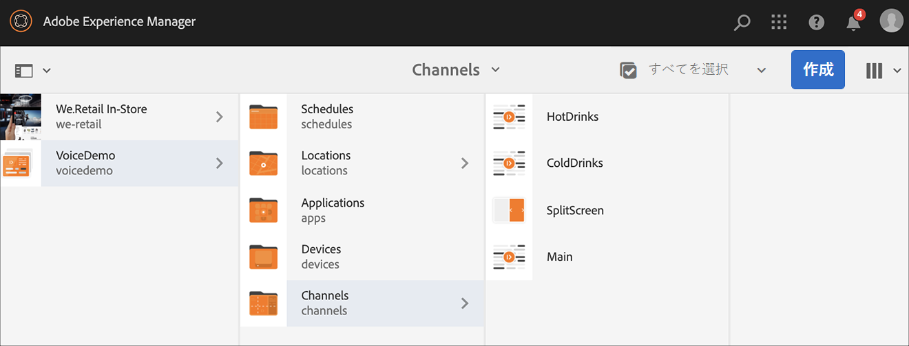
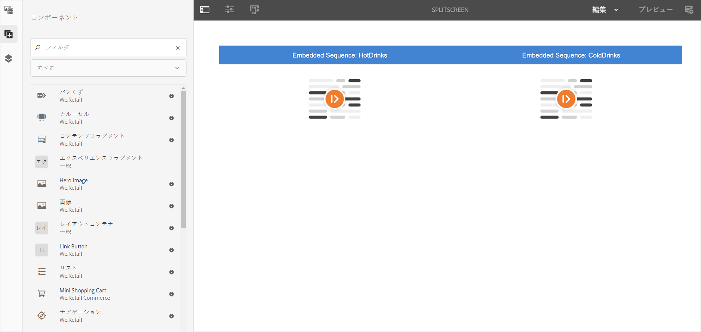
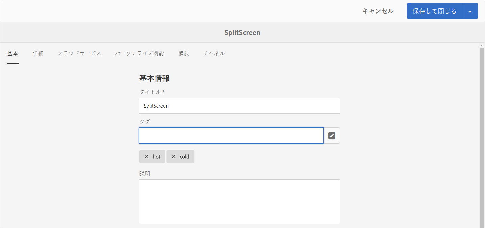
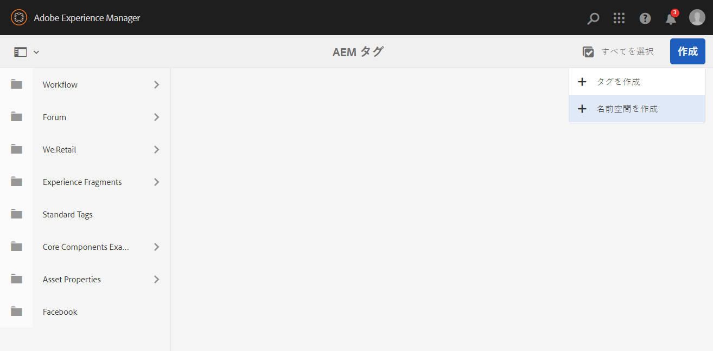
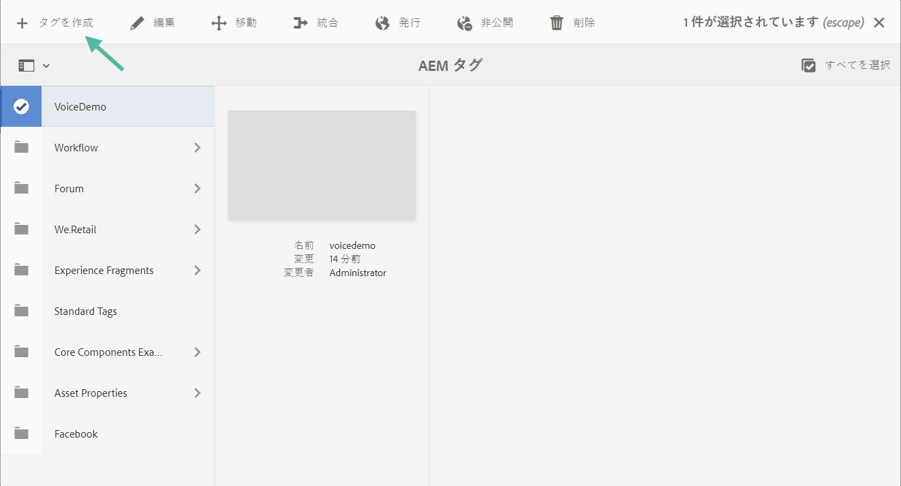
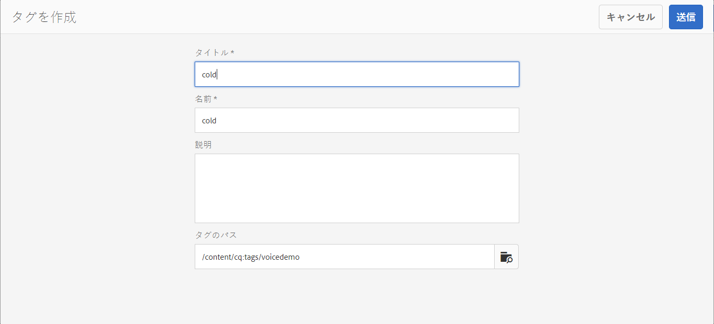

# AEM Screens の音声認識 {#voice-recognition}

>[!IMPORTANT]
>
>**プライバシーに関する重要な情報**
>
>音声認識機能を使用する場合は、地域に適用される法的および倫理的なガイドラインに従ってください（プレーヤーが音声認識を使用していることをエンドユーザーに明確に通知する場合を含みますが、これに限定されません）。Adobe Inc は、音声に関連する情報を受け取らず、保存も処理もしません。AEM Screens Player は、ブラウジングエンジンに組み込まれている標準的な Web 音声 API を使用します。この API の内部で、音声の波形は Google サーバーに送られて音声からテキストへ変換され、プレーヤーによるテキストと設定済みキーワードとの照合がおこなわれます。
>
>詳しくは、[Web 音声 API についての Google のプライバシーに関するホワイトペーパー](https://www.google.com/chrome/privacy/whitepaper.html#speech)を参照してください。

音声認識機能を使用すると、音声操作によって駆動される AEM Screens チャネルのコンテンツを変更できます。

コンテンツ作成者は、ディスプレイを音声対応となるよう設定できます。この機能の目的は、顧客が音声を使用してディスプレイを操作できるようにすることです。同様の使用例としては、店舗でお勧め商品を探す、食堂やレストランでメニューのアイテムを注文するなどがあります。この機能により、ユーザーのアクセシビリティが向上し、顧客体験を大幅に向上させることができます。

>[!NOTE]
>プレーヤーハードウェアは、マイクなどの音声入力をサポートする必要があります。

## 音声認識の実装 {#implementing}

>[!IMPORTANT]
> 音声認識機能は、Chrome OS および Windows プレーヤーでのみ使用できます。

AEM Screens プロジェクトで音声認識を実装するには、ディスプレイの音声認識を有効にし、各チャネルを固有のタグに関連付けて、チャネルトランジションをトリガーする必要があります。

次の節では、AEM Screensプロジェクトで音声認識機能を有効にして使用する方法について説明します。

## 全画面または分割画面チャネルスイッチでのコンテンツ表示 {#sequence-channel}

音声認識機能を使用する前に、プロジェクトと、プロジェクト用に設定されたコンテンツを持つチャネルがあることを確認してください。

1. 次の例では、**VoiceDemo** という名前のデモプロジェクトと、**Main**、**ColdDrinks**、**HotDrinks**（以下の図）の 3 つのシーケンスチャネルを示しています。

   

   >[!NOTE]
   >
   >チャネルを作成する方法、またはチャネルにコンテンツを追加する方法については、[チャネルの作成と管理](/help/user-guide/managing-channels.md)を参照してください。

   または、

   You can create three sequence channels **Main**, **ColdDrinks**, and **HotDrinks**, and one additional 1x2 Split Screens channel **SplitScreen** as shown in the figure below.

   

1. 各チャネルに移動し、コンテンツを追加します。例えば、**VoiceDemo**／**チャネル**／**Main** に移動し、チャネルを選択します。アクションバーの「**編集**」をクリックしてエディターを開き、必要に応じてコンテンツ（画像／ビデオ）を追加します。同様に、**ColdDrinks** と **HotDrinks** の両方のチャネルにコンテンツを追加します。

   次の図に示すように、チャネルにアセット（画像）が含まれるようになりました。

   **Main**：

   

   **ColdDrinks**：

   

   **HotDrinks**：

   

   プロジェクトに分割画面チャネルを追加した場合は、**SplitScreen** に移動して 2 つの埋め込みシーケンスをドラッグ&amp;ドロップし、**ColdDrinks** と **HotDrinks** チャネルの両方にパスを追加します（下図を参照）。
   

### チャネル用のタグのセットアップ {#setting-tags}

チャネルにコンテンツを追加したら、各チャネルに移動し、音声認識をトリガーする適切なタグを追加する必要があります。

下の手順に従って、チャネルにタグを追加します。

1. 各チャネルに移動し、コンテンツを追加します。例えば、**VoiceDemo**／**チャネル**／**Main** に移動し、チャネルを選択します。

1. アクションバーの「**プロパティ**」をクリックします。

   

1. 「**基本**」タブに移動し、「**タグ**」フィールドから既存のタグを選択するか、新しいタグを作成します。

   次の図に示すように、タグに新しい名前を入力して `return` キーを押すと、新しいタグを作成できます。

   

   または、

   また、事前にAEMインスタンスからプロジェクト用のタグを作成して、それらを選択することもできます。 [タグの作成](#creating-tags)で説明されている手順に従うと、次の図に示すように、その場所からタグを選択し、チャネルに追加できます。

   

1. 同様に、「**温かい**」とタイトルを付けたタグを **HotDrinks** チャネルに追加します。

1. 画面を分割チャネルを使用する場合は、次の図に示すように、**SplitScreen** チャネルプロパティに両方のタグ( **ホット**&#x200B;と **コールド** )を追加します。

   

1. 完了したら、「**保存して閉じる**」をクリックします。

### タグの作成 {#creating-tags}

次の手順に従ってタグを作成します。

1. AEM インスタンスに移動します。

1. Click on tools icon --> **Tagging**.
   

1. **作成**／**名前空間を作成**をクリックします。
   

1. プロジェクトの名前（例：**VoiceDemo**）を入力し、「**作成**」をクリックします。

1. **VoiceDemo** プロジェクトを選択し、アクションバーの「**タグを作成**」をクリックします。
   

1. タグの名前を入力し、「**送信**」をクリックします。
   

これらのタグを AEM Screens プロジェクトで使用できるようになりました。

### ディスプレイへのチャネルの割り当ておよび音声認識の有効化 {#channel-assignment}

1. 下の図に示すように、**ロケーション**&#x200B;フォルダーにディスプレイを作成します。

   

   >[!NOTE]
   >ディスプレイにチャネルを割り当てる方法については、[ディスプレイの作成と管理](/help/user-guide/managing-displays.md)を参照してください。

1. チャネル（**Main**、**ColdDrinks**、**HotDrinks**）を **LobbyDisplay** に割り当てます。また、プロジェクトにSplitScreen **** チャネルを使用している場合は、それをディスプレイに割り当てていることを確認します。

   >[!NOTE]
   >分割画面チャネルを作成した場合は、**SplitScreen** チャネルもディスプレイに割り当てます。

1. チャネルを割り当てる際に、各チャネルに次のプロパティを設定します。

   | **チャネル名** | **優先度** | **サポートされているイベント** |
   |---|---|---|
   | メイン | 2 | 初期ロード、待機中画面、タイマー |
   | HotDrinks | 1 | ユーザーインタラクション |
   | ColdDrinks | 1 | ユーザーインタラクション |
   | SplitScreen | 1 | ユーザーインタラクション |

   >[!NOTE]
   >
   >ディスプレイにチャネルを割り当てる方法については、[ディスプレイの作成と管理](/help/user-guide/managing-displays.md)を参照してください。

1. ディスプレイにチャネルを割り当てたら、**LobbyDisplay** に移動して、ディスプレイを選択します。アクションバーから「**プロパティ**」を選択します。

1. 「**表示**」タブに移動し、「**コンテンツ**」の「**音声対応**」オプションを有効にします。

   

   >[!IMPORTANT]
   >ディスプレイから音声認識機能を有効にする必要があります。

### Chrome Player でのコンテンツの表示 {#viewing-content}

上記の手順が完了したら、Chrome デバイスを登録して出力を表示できます。

>[!NOTE]
>デバイスを AEM Screens プレーヤーに登録する方法については、[デバイス登録](device-registration.md)を参照してください。

**シーケンスチャネルの目的の出力**

**Main** チャネルはコンテンツを再生していますが、キーワードの「**温かい**」が使用された場合（例：*温かいものが飲みたい*）、チャネルは **HotDrinks** チャネルのコンテンツの再生を開始します。

Similarly, if you use word with a keyword **cold** such as *I would like to haves something cold*, the channel starts playing the contents of the **ColdDrinks** channel.

**「Split Screens」チャネルの出力**

**Main** チャネルはコンテンツを再生していますが、キーワードの「**温かい**」と「**冷たい**」が一緒に使用された場合（例：*温かい飲み物と冷たい飲み物のメニューが見たい*）、チャネルは **SplitScreen** チャネルのコンテンツの再生を開始します。*メインメニューに戻る*&#x200B;と言うと、メインチャネルに戻ります。

