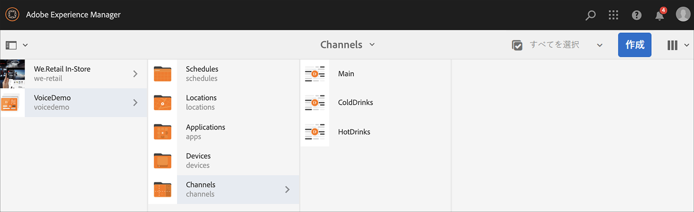
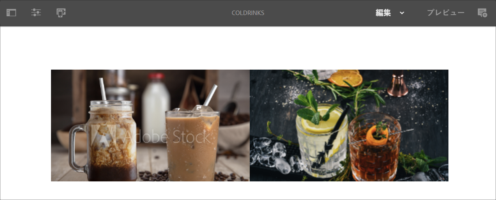
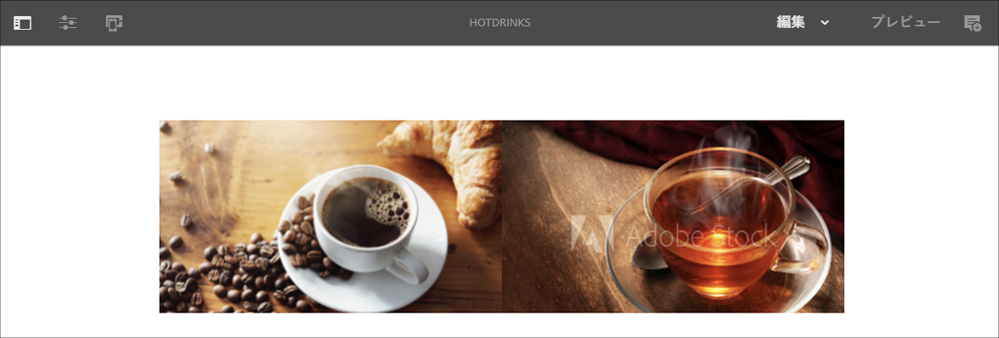
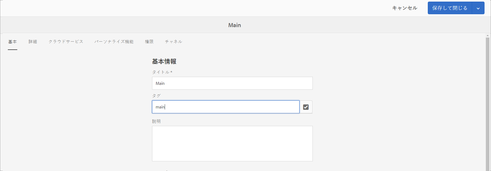
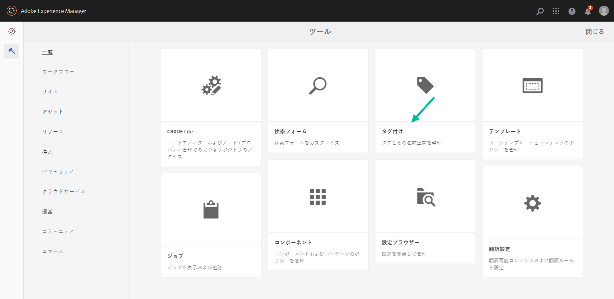
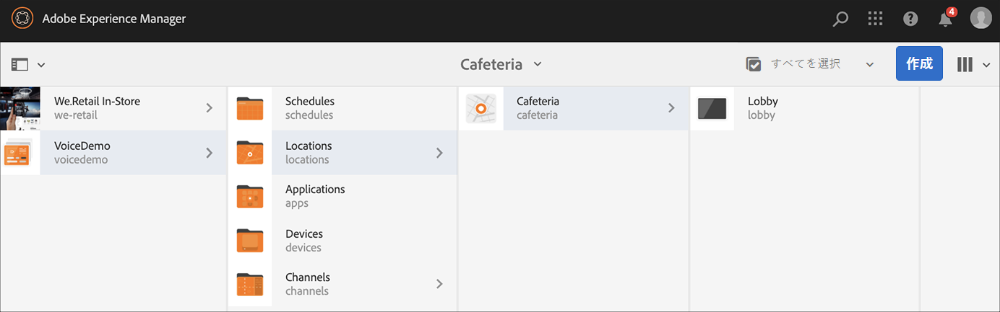
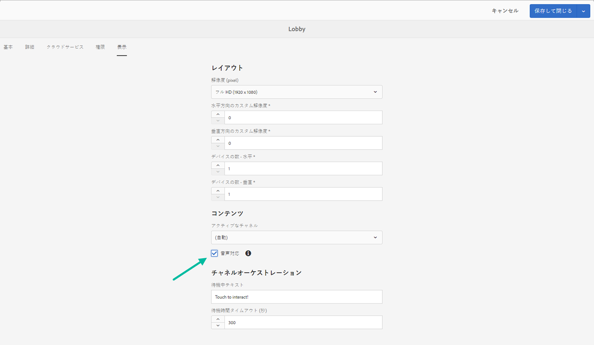

# AEM Screensでの音声認識 {#voice-recognition}

>[重要]
>**プライバシーに関する重要な情報**
>音声認識機能を使用する場合は、地域に適用される法的および倫理的なガイドラインに従ってください（プレイヤーが音声認識を使用していることをエンドユーザーに対して表示する通知を含みますが、これに限定されません）。 Adobe Incは、音声関連情報を受け取らず、保存も処理もしません。 AEM Screensプレーヤーは、閲覧エンジンに組み込まれている標準的なWeb音声APIを使用します。 内部では、音声からテキストへの変換のためにGoogleサーバーに音声の波形が送信され、このテキストがプレイヤーによって設定されたキーワードと照合されます。
>
>詳しくは、 [Googleプライバシーに関するホワイトペーパー(Web Speech API](https://www.google.com/chrome/privacy/whitepaper.html#speech) )を参照してください。

## 概要 {#overview}

音声認識機能を使用すると、音声操作によって駆動されるAEM Screensチャネルのコンテンツを変更できます。

コンテンツ作成者は、ディスプレイを音声対応に設定できます。 この機能の目的は、お客様がディスプレイと対話する方法として音声を利用できるようにすることです。 同様の使用例としては、店舗で商品のレコメンデーションを探す、ディナーやレストランでメニューアイテムを注文するなどがあります。 この機能により、ユーザーのアクセシビリティが向上し、顧客体験を大幅に向上させることができます。

>[!NOTE]
>プレイヤーハードウェアは、マイクなどの音声入力をサポートする必要があります。

>[!IMPORTANT]
> 音声認識機能は、Chromeおよび電子プレーヤーでのみ使用できます。

## 音声認識の実装 {#implementing}

AEM Screensプロジェクトで音声認識を実装するには、ディスプレイの音声認識を有効にし、各チャネルを固有のタグに関連付けて、チャネルトランジションをトリガする必要があります。

次の節では、AEM Screensプロジェクトで音声認識機能を有効にして使用する方法について説明します。

### プロジェクトのセットアップ {#setting-up}

音声認識機能を使用する前に、プロジェクトと、コンテンツが設定されたチャネルがプロジェクトにあることを確認してください。

1. 次の例では、VoiceDemo **という名前のデモプロジェクトと、** Main **、** ColdDrinks **、HotDrinksの3つのシーケンスチャネルーを示しています。次の図はHotDrinksで******&#x200B;す。

   

   >[!NOTE]
   >
   >チャネルを作成する方法、またはチャネルにコンテンツを追加する方法については、[チャネルの作成と管理](/help/user-guide/managing-channels.md)を参照してください。

1. 各チャネルに移動し、コンテンツを追加します。 例えば、 **VoiceDemo** —> **チャネル** —> **Main** に移動し、チャネルを選択します。 アクションバーの「 **編集** 」をクリックしてエディターを開き、必要に応じてコンテンツ（画像/ビデオ）を追加します。 同様に、ColdDrinks **チャネルーとHotDrinks****** ーの両方にコンテンツを追加します。

   次の図に示すように、チャネルにはアセット（画像）が含まれるようになりました。

   **メイン**:

   

   **ColdDrinks**:

   

   **HotDrinks**:

   

### Setting up Tags for Channels {#setting-tags}

チャネルにコンテンツを追加したら、各チャネルに移動し、音声認識をトリガーする適切なタグを追加する必要があります。

次の手順に従って、チャネルにタグを追加します。

1. 各チャネルに移動し、コンテンツを追加します。 例えば、 **VoiceDemo** —> **チャネル** —> **Main** に移動し、チャネルを選択します。

1. アクションバーの「**プロパティ**」をクリックします。

   

1. 「 **Basics** 」タブに移動し、「 **Tags** （タグ）」フィールドから既存のタグを選択するか、新しいタグを作成します。

   次の図に示すように、新しいタグ名を入力して新しいタグを作成できます。

   

   または、

   事前にAEMインスタンスからプロジェクト用のタグを作成し、それらも選択できます。 「タグの [作成](#creating-tags)」で説明されている手順に従うと、次の図に示すように、場所からタグを選択し、チャネルに追加できます。

   

1. 完了したら、「 **保存して閉じる** 」をクリックします。

同様に、「 **hot** 」というタグをHotDrinks **** チャネルに追加します。

#### タグの作成 {#creating-tags}

次の手順に従ってタグを作成します。

1. AEMインスタンスに移動します。
1. ツール/ **タグ付けをクリックします**。
   
1. Click **Create** --> **Create Namespace**.
   
1. プロジェクトの名前を入力します。例： **VoiceDemo** 、「作成」をクリックします。
1. Select the **VoiceDemo** project and click **Create Tag** from the action bar.
1. 「**送信**」をクリックします。

### ディスプレイにチャネルを割り当て、音声認識を有効にする {#channel-assignment}

1. 下の図に示すように、**ロケーション**&#x200B;フォルダーにディスプレイを作成します。

   

   >[!NOTE]
   >ディスプレイにチャネルを割り当てる方法については、[ディスプレイの作成と管理](/help/user-guide/managing-displays.md)を参照してください。

1. チャネル **Main**、 **ColdDrinks**、HotDrinksをLobbyDisplay ******** dirknsに割り当てます。

1. チャネルを割り当てる際に、各チャネルに次のプロパティを設定します。

   * メイン
   * ホットドリンク
   * ColdDrinks

   >[!NOTE]
   >
   >ディスプレイにチャネルを割り当てる方法については、[ディスプレイの作成と管理](/help/user-guide/managing-displays.md)を参照してください。

1. ディスプレイにチャネルを割り当てたら、LobbyDisplayに移動し **て** 、ディスプレイを選択します。 アクションバーから「**プロパティ**」を選択します。

1. 「 **表示** 」タブに移動し、「 **コンテンツ** 」の「音声対応 ****」オプションを有効にします。

   

   >[!IMPORTANT]
   >ディスプレイから音声認識機能を有効にする必要があります。

#### Chrome Playerでのコンテンツの表示 {#viewing-content}

上記の手順が完了したら、Chromeデバイスを登録し、出力表示を登録できます。

>[!NOTE]
>デバイスを [AEM Screensプレイヤに登録する方法については、Device Registration](device-registration.md) （デバイス登録）を参照してください。

この例は、Chrome Playerの出力を示します。

