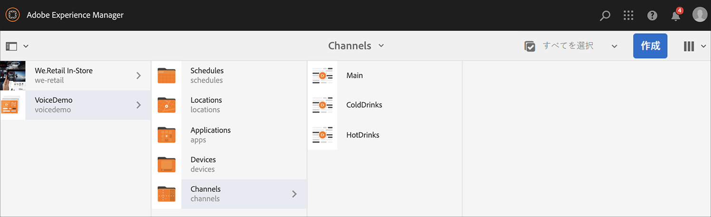
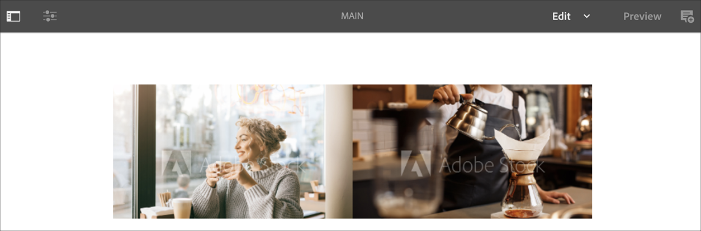
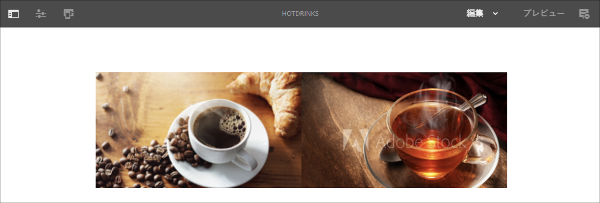
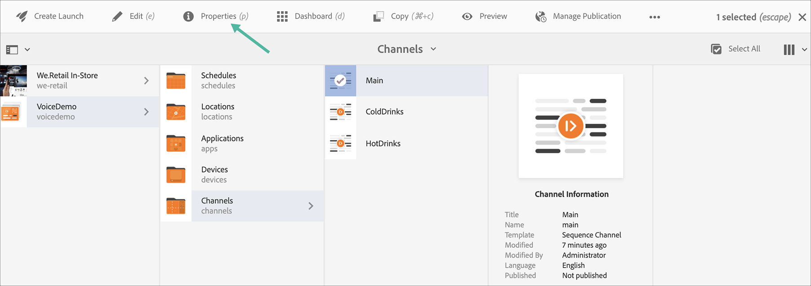
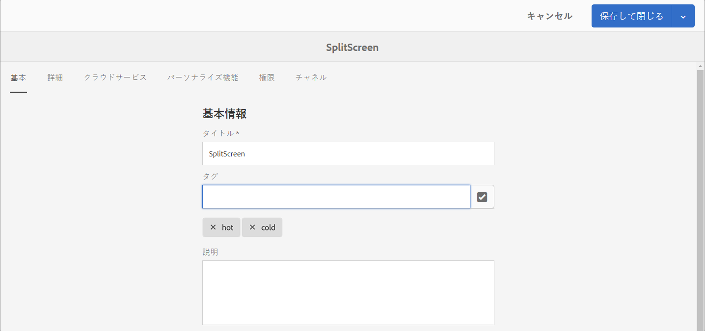
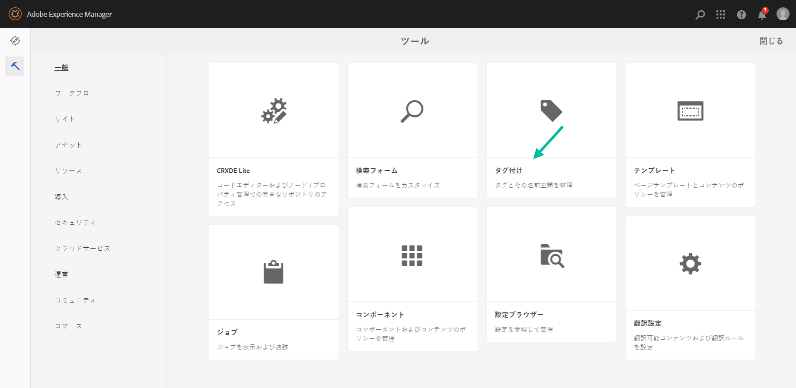
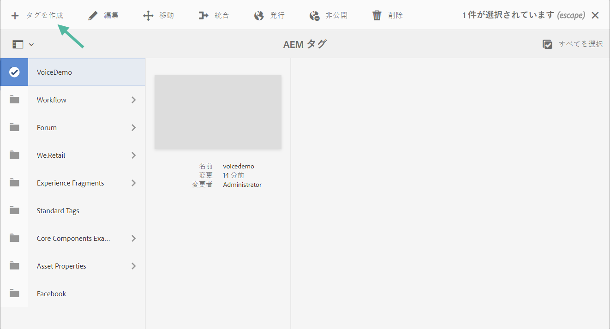
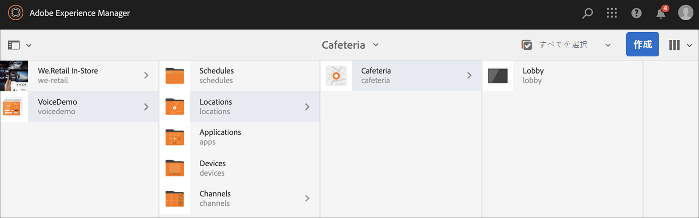
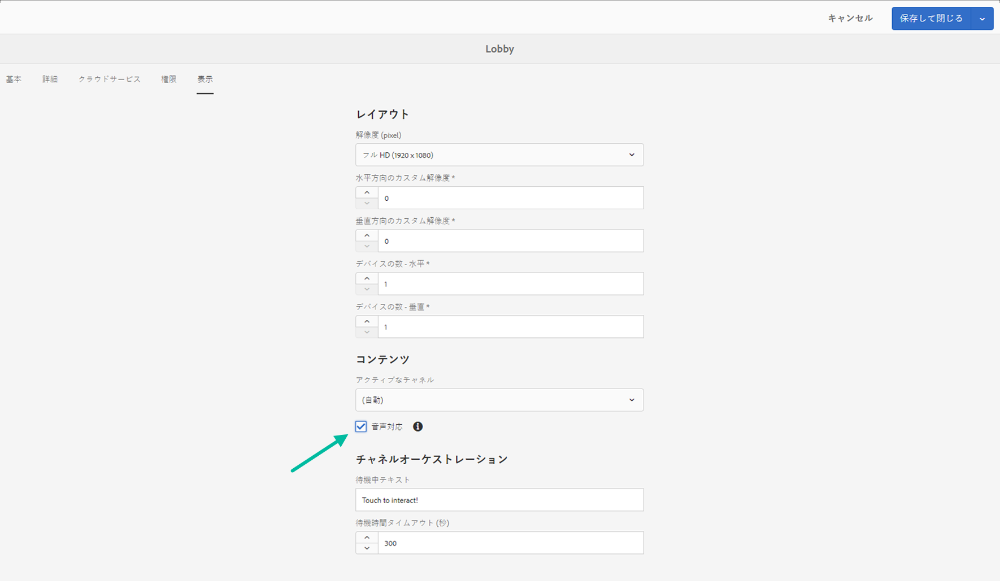

# AEM Screens の音声認識 {#voice-recognition}

>[!IMPORTANT]
>このコンテンツは、AEM オンプレミス/AMS （AEM 6.5LTSおよびAEM 6.5）に対して有効です。 AEM as a Cloud Service Screensの内容については、[AEM as a Cloud Service ガイド &#x200B;](https://experienceleague.adobe.com/ja/docs/experience-manager-cloud-service/content/screens-as-cloud-service/overview/introduction)を参照してください。

>[!IMPORTANT]
>
>**プライバシーに関する重要な情報**
>
>音声認識機能を使用する場合は、お住まいの地域に適用されるすべての法的および倫理的ガイドラインに従ってください。 これらのガイドラインには、プレーヤーが音声認識を使用していることをエンドユーザーに視覚的に通知することが含まれますが、これに限定されるものではありません）。 アドビは、音声に関連する情報を受け取らず、保存も処理もしません。 AEM Screens Player は、ブラウジングエンジンに組み込まれている標準的な web 音声 API を使用します。 この API はバックグラウンドで、音声をテキストに変換するため、音声の波形を Google のサーバーに送信します。 プレーヤーは、テキストを設定済みのキーワードと照合します。
>
>詳しくは、[web 音声 API についての Google のプライバシーに関するホワイトペーパー](https://www.google.com/chrome/privacy/whitepaper.html#speech)を参照してください。

音声認識機能を使用すると、音声操作によって駆動される AEM Screens チャネルのコンテンツを変更できます。

コンテンツ作成者は、ディスプレイを音声対応となるよう設定できます。 この機能の目的は、顧客がディスプレイとやり取りする方法として音声を使用できるようにすることです。 同様の使用例としては、店舗でお勧め商品を探す、食堂やレストランでメニューのアイテムを注文するなどがあります。 この機能により、ユーザーのアクセシビリティが向上し、顧客体験を大幅に向上させることができます。

>[!NOTE]
>プレーヤーハードウェアは、マイクなどの音声入力をサポートする必要があります。

## 音声認識の実装 {#implementing}

>[!IMPORTANT]
> 音声認識機能は、Chrome OS および Windows プレーヤーでのみ使用できます。

AEM Screens プロジェクトで音声認識を実装するには、ディスプレイの音声認識を有効にし、各チャネルを固有のタグに関連付けて、チャネルトランジションをトリガーします。

次の節では、AEM Screens プロジェクトで音声認識機能を有効にして使用する方法について説明します。

## 全画面または分割画面チャネルスイッチでのコンテンツ表示 {#sequence-channel}

音声認識機能を使用する前に、プロジェクトと、プロジェクト用にコンテンツが設定されたチャネルがあることを確認してください。

1. 次の例では、**VoiceDemo** という名前のデモプロジェクトと、**Main**、**ColdDrinks**、**HotDrinks**（以下の図）の 3 つのシーケンスチャネルを示しています。

   

   >[!NOTE]
   >
   >チャネルを作成する方法、またはチャネルにコンテンツを追加する方法については、[チャネルの作成と管理](/help/user-guide/managing-channels.md)を参照してください。

   または、

   3 つのシーケンスチャネル、**Main**、**ColdDrinks**、**HotDrinks** を作成し、さらに 1x2 の分割画面チャネル **SplitScreen** を 1 つ追加します（下の図を参照）。

   

1. 各チャネルに移動し、コンテンツを追加します。 例えば、**VoiceDemo**／**チャネル**／**メイン**&#x200B;に移動し、チャネルをクリックします。 アクションバーの「**編集**」をクリックし、必要に応じてコンテンツ（画像／ビデオ）を追加します。 同様に、**ColdDrinks** と **HotDrinks** の両方のチャネルにコンテンツを追加します。

   次の図に示すように、チャネルにアセット（画像）が含まれるようになりました。

   **Main**：

   

   **ColdDrinks**：

   

   **HotDrinks**：

   

   分割Screens チャンネルをプロジェクトに追加した場合は、**SplitScreen**&#x200B;に移動し、埋め込まれた2つのシーケンスをドラッグ&amp;ドロップします。次の図に示すように、**ColdDrinks**&#x200B;と&#x200B;**HotDrinks** チャネルの両方にパスを追加します。
   

### チャネル用のタグのセットアップ {#setting-tags}

チャンネルにコンテンツを追加したら、各チャンネルに移動し、音声認識をトリガーする適切なタグを追加します。

下の手順に従って、チャネルにタグを追加します。

1. 各チャネルに移動し、コンテンツを追加します。 例えば、**VoiceDemo**／**チャネル**／**メイン**&#x200B;に移動し、チャネルをクリックします。

1. アクションバーの「**プロパティ**」をクリックします。

   

1. 「**基本**」タブに移動し、「**タグ**」フィールドから既存のタグをクリックするか、新しいタグを作成します。

   次の図に示すように、タグに新しい名前を入力して `return` キーを押して、タグを作成することもできます。

   

   または、

   事前に AEM インスタンスからプロジェクト用のタグを作成して、選択することもできます。 [タグの作成](#creating-tags)で説明されている手順に従うと、次の図に示すように、その場所からタグをクリックし、チャネルに追加できます。

   

1. 同様に、「**温かい**」とタイトルを付けたタグを **HotDrinks** チャネルに追加します。

1. 分割画面チャネルを使用する場合は、次の図に示すように、**SplitScreen** チャネルプロパティに両方のタグ（**暖かい**&#x200B;と&#x200B;**冷たい**）を追加します。

   

1. 完了したら、「**保存して閉じる**」をクリックします。

### タグの作成 {#creating-tags}

次の手順に従ってタグを作成します。

1. AEM インスタンスに移動します。

1. ツールアイコン／**タグ付け**&#x200B;をクリックします。
   

1. **作成**／**名前空間を作成**&#x200B;をクリックします。
   

1. プロジェクトの名前（例：**VoiceDemo**）を入力し、「**作成**」をクリックします。

1. **VoiceDemo** プロジェクトをクリックし、アクションバーの「**タグを作成**」をクリックします。
   

1. タグの名前を入力し、「**送信**」をクリックします。
   

これらのタグを AEM Screens プロジェクトで使用できるようになりました。

### ディスプレイへのチャネルの割り当ておよび音声認識の有効化 {#channel-assignment}

1. 下の図に示すように、**ロケーション**&#x200B;フォルダーにディスプレイを作成します。

   

   >[!NOTE]
   >ディスプレイにチャネルを割り当てる方法については、[ディスプレイの作成と管理](/help/user-guide/managing-displays.md)を参照してください。

1. チャネル（**Main**、**ColdDrinks**、**HotDrinks**）を **LobbyDisplay** に割り当てます。 また、プロジェクトに **SplitScreen** チャネルを使用している場合は、それをディスプレイに割り当てていることを確認します。

   >[!NOTE]
   >分割画面チャネルを作成した場合は、**SplitScreen** チャネルもディスプレイに割り当てます。

1. チャネルを割り当てる際に、各チャネルに次のプロパティを設定します。

   | **チャネル名** | **優先度** | **サポートされているイベント** |
   |---|---|---|
   | メイン | 2 | 初期ロード、待機中画面、タイマー |
   | HotDrinks | 1 | ユーザーインタラクション |
   | ColdDrinks | 1 | ユーザーインタラクション |
   | SplitScreen | 1 | ユーザーインタラクション |

   >[!NOTE]
   >
   >ディスプレイにチャネルを割り当てる方法については、[ディスプレイの作成と管理](/help/user-guide/managing-displays.md)を参照してください。

1. ディスプレイにチャネルを割り当てたら、**LobbyDisplay** に移動して、ディスプレイをクリックします。 アクションバーの「**プロパティ**」をクリックします。

1. 「**ディスプレイ**」タブに移動し、**コンテンツ**&#x200B;の「**音声対応**」オプションを有効にします。

   

   >[!IMPORTANT]
   >ディスプレイから音声認識機能を有効にする必要があります。

### Chrome Player でのコンテンツの表示 {#viewing-content}

上記の手順が完了したら、Chrome デバイスを登録して出力を表示できます。

>[!NOTE]
>[デバイスの登録](device-registration.md)を参照してください。

**シーケンスチャネルの求められる出力**

**Main** チャネルがコンテンツを再生しています。 ただし、キーワードの「**温かい**」が使用されると（例：*温かいものが飲みたい*）、チャンネルは **HotDrinks** チャンネルのコンテンツの再生を開始します。

同様に、キーワードの「**冷たい**」が使用された場合（例：*冷たいものが飲みたい*）、チャネルは **ColdDrinks** チャネルのコンテンツの再生を開始します。

**分割画面チャネルに対する目的の出力**

**Main** チャネルがコンテンツを再生しています。 ただし、キーワードの「**温かい**」と「**冷たい**」が一緒に使用された場合（例：*温かい飲み物と冷たい飲み物のメニューが見たい*）、チャンネルは **SplitScreen** チャンネルのコンテンツを再生します。 「*メインメニューに戻る*」と言うと、**Main** チャネルに戻ります。
