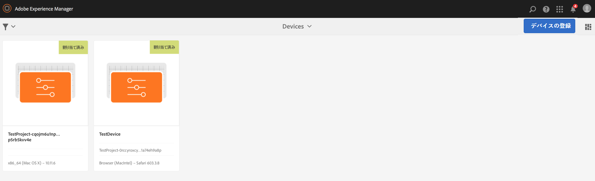
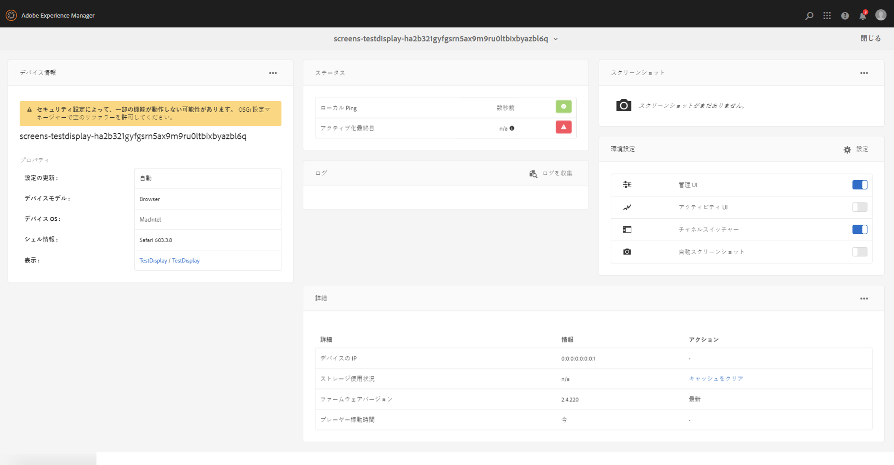
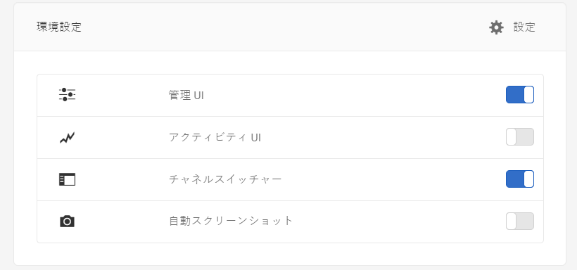
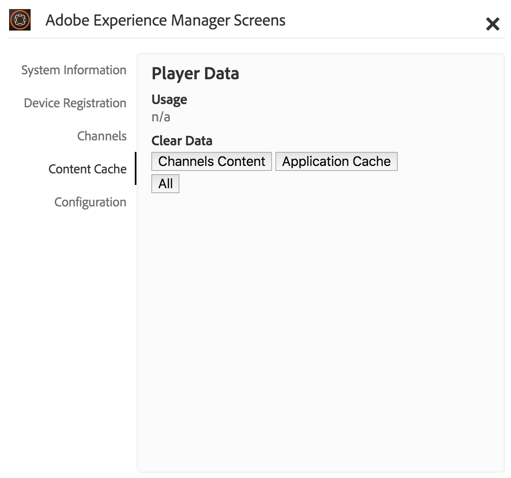

# AEM Screens Player での作業 {#working-with-aem-screens-player}

AEM Screens Player でチャネルコンテンツなどの設定を管理できます。

>[!NOTE]
>
>***Ctrl+Cmd+F*** を押すと、OS X AEM Screens Player のフルスクリーンモードを終了できます。

チャネルをディスプレイに割り当てると AEM Screens Player にコンテンツが表示されます。Admin UI の環境設定（ダッシュボード上）を使用して、またはプレーヤー自体からプレーヤーの設定を構成できます。

## デバイスダッシュボードの使用  {#using-the-device-dashboard}

AEM オーサリングインスタンスを介してアクセスできる、デバイスダッシュボードからデバイスの環境設定を構成できます。

1. プロジェクトからデバイスダッシュボードに移動します（例：***Test Project***／***デバイス***）。

   アクションバーから「**デバイス**」および「**デバイスマネージャー**」を選択します。

   

1. デバイスをクリックしてデバイスダッシュボードを開きます。

   

1. **環境設定**&#x200B;パネルを確認します。オプションからプレーヤーの「**管理 UI**」と「**チャネルスイッチャー**」の有効／無効を切り替えることができます。

   

### 管理 UI {#the-admin-ui}

環境設定パネルから「**管理 UI**」を有効にすると、ユーザーは Screens Player から管理者設定を開くことができます。さらに、このオプションをデバイスダッシュボードから無効にすると、ユーザーはプレーヤーから Admin UI を開くことができなくなります。

Screens Player から Admin UI を表示するには、タッチ有効の AEM Screens Player またはマウスを使用して左上角を長押しして、Admin メニューを開きます。登録が完了しチャネルがロードされた後、ここに情報が表示されます。

>[!NOTE]
>
>さらに、AEM Screens Player アプリのアップタイムを表示して、アプリの正常性をチェックできます。

#### 設定メニューオプションへのアクセス {#configuration-options}

次の図に示すように、サイドメニューから「**設定**」オプションを選択すると、設定を更新できます。

設定メニューでは、次の設定を変更できます。

* このダイアログボックスから、**ファームウェア**、**環境設定**、または&#x200B;**デフォルト設定**&#x200B;をリセットします。

* AEM Screens プレーヤーに対して保持するログファイルの最大数は、「**保持するログファイルの最大数**」で指定します。

* Screens プレーヤーの&#x200B;**管理者メニュー**、**チャネル切り替え**、**アクティビティ UI** を有効または無効にします。

   **設定**&#x200B;メニューで&#x200B;**アクティビティ UI** が有効になっている場合、次の図に示すように、AEM Screens プレーヤーの右上隅に&#x200B;*プレーヤーアクティビティ通知*&#x200B;が表示されます。

   

>[!NOTE]
>
>「**ファームウェアを更新**」オプションは、Android プレーヤーなどの cordova でのみ機能します。

>[!NOTE]
>
>実稼動デプロイメントでは&#x200B;**管理 UI** を無効にすることをお勧めします。

#### コンテンツキャッシュメニューオプションへのアクセス {#content-cache-options}

AEM Screens Player の Admin UI から、チャネルおよびアプリケーションのキャッシュをクリアできます。

サイドレールから「**コンテンツキャッシュ**」を選択して、キャッシュを更新します。

### チャネルスイッチャー {#the-channel-switcher}

環境設定パネルから「**チャネルスイッチャー**」を有効にすると、Screens Player からチャネル選択／設定を開くことができます。

さらに、このオプションをデバイスダッシュボードから無効にすると、ユーザーは、Screens Player からチャネル環境設定を管理できなくなります。

Screens Player からチャネルの設定を切り替えて管理できます。

プレーヤーからチャネルスイッチャーを表示するには、左下角を長押しします。こうするとチャネルスイッチャーが開いて、チャネルなどの機能を切り替えることができます。

>[!NOTE]
>
>また、Screens player から管理者メニューおよびプレーヤー用のチャネルスイッチャーの有効と無効を切り替えることができます。
>
>（下のセクションで言及されている「*Screens Player からの設定変更*」を参照してください）

### AEM Screens Player からの設定管理  {#managing-preferences-from-the-aem-screens-player}

プレーヤー自体からも Admin UI およびチャネルスイッチャーの設定を変更できます。

以下の手順に従って、プレーヤーから設定を変更します。

1. アイドルチャネルの左上角を長押しして管理者パネルを開きます。
1. 左のアクションメニューから&#x200B;**設定**&#x200B;に移動します。
1. **Admin UI** または&#x200B;**チャネルスイッチャー**&#x200B;の設定の有効／無効を切り替えます。

## AEM Screens Player のトラブルシューティング {#troubleshooting-aem-screens-player}

AEM Screens Player に関係する様々な問題をトラブルシューティングすることができます。

| **問題** | **推奨事項** |
|---|---|
| プレーヤーのストレージがいっぱいです | 不要なファイルを削除してください |
| プレーヤーのネットワーク接続が途切れました | Cat-5/Cat-6 ケーブルを使用してください。Wi-Fi の場合は、ルーターからプレーヤーデバイスまでの距離を短くしてください |
| AEM Screens Player がクラッシュしました | AEM Screens Player が常時動作しているようにウォッチドッグアプリを使用することをお勧めします |
| AEM Screens Player の設定がなくなりました | AEM サーバーへの接続を確認してください |
| AEM Screens Player が再起動後に自動起動しません | OS のスタートフォルダーまたは初期化手順を確認してください |
| AEM Screens Player のコンテンツ表示が間違っていたり古かったりします | ネットワーク接続を確認してください |

### AEM Screens Player のアップデート {#updates-for-aem-screens-player}

AEM Screens Player には、次の 2 とおりの更新方法があります。

| **方法** | **詳細** | **リモート経由** | **自動** | **ダウンタイムなし** |
|---|---|---|---|---|
| ファームウェアの更新 | リモートコマンドを介して既存のインストール済みプレーヤーに適用されます。アップデート後に、プレーヤーは既存のコンテンツで自動リロードされます。 | はい | カスタム | ほぼ 1～3 秒 |
| プレーヤーシェルの更新 | これは、プレーヤーにデプロイされる新しい実行可能ファイルです。これには、新しいバイナリをプレーヤーにリモートコピーして、現在実行中のプレーヤーを停止して、新しいバージョンを起動する必要があります。これには、事前ロードされているパッケージの再ダウンロードが必要なことがあります。 | はい（リモートシェル経由） | カスタム | いいえ |

## プレーヤーデバイスのハードウェア選定ガイドライン {#hardware-selection-guidelines-for-player-device}

この節では、Screens プロジェクトのハードウェア選定ガイドラインを示します。

* PC プレーヤーにもディスプレイパネルまたはプロジェクターにも、常に&#x200B;***商用***&#x200B;または&#x200B;***工業用***&#x200B;クラスのコンポーネントを調達します。

* デジタルサイネージマーケットに商品を提供しているベンダーと常に連携します。
* 周囲の気温や相対湿度などの環境要因を常に考慮に入れます。
* 電源要件と電力調整を常に確認します。
* パフォーマンスのニーズとアプリケーションに必要な I/O ポートを慎重に確認します。

AEM Screens プロジェクトの典型的な使用例に対応するハードウェア構成を次の表にまとめます。

<table>
 <tbody>
  <tr>
   <td>プレーヤー設定</td>
   <td>プロセッサー</td>
   <td>メモリ</td>
   <td>ストレージ SSD</td>
   <td>GPU</td>
   <td>ディスプレイ</td>
   <td>I/O</td>
   <td>典型的な使用例</td>
  </tr>
  <tr>
   <td>基本</td>
   <td>デュアルコア、i3 またはエントリーレベルのクアッドコア Intel® Atom プロセッサー</td>
   <td>
4 GB のメモリ
 
2 MB のキャッシュ
 </td>
   <td>
・Chrome OS：32 GB
 
・Windows：128 GB
 </td>
   <td>オンボード</td>
   <td>1920 x 1080</td>
   <td>DVI、 イーサネット／ワイヤレス、 USB x 2</td>
   <td>
    <ul>
     <li>標準フルスクリーンループ  </li>
     <li>日分割</li>
    </ul> </td>
  </tr>
  <tr>
   <td>標準</td>
   <td>クアッドコア、Intel® Core i5 プロセッサー</td>
   <td>
8 GB のメモリ
 
4 MB のキャッシュ
 </td>
   <td>128 GBB</td>
   <td>オンボード</td>
   <td>3840 x 2160（4K）</td>
   <td>DVI、HDMI  イーサネット／ワイヤレス、 USB x 2</td>
   <td>
    <ul>
     <li>単一ソースの動的コンテンツ</li>
     <li>シンプルインタラクティブ</li>
     <li>1～3 ゾーンレイアウト</li>
    </ul> </td>
  </tr>
  <tr>
   <td>アドバンス</td>
   <td>ハイパースレッディング対応クアッドコア、Intel® Core i7 プロセッサー</td>
   <td>
16 GB のメモリ
 
8 MB のキャッシュ
 </td>
   <td>256 GB</td>
   <td>専用グラフィック GPU</td>
   <td>3840 x 2160（4K）</td>
   <td>DVI、HDMI  イーサネット／ワイヤレス、 USB x 4</td>
   <td>
    <ul>
     <li>4 つ以上のコンテンツゾーン、同時ビデオ再生</li>
     <li>複数ページインタラクティブ</li>
     <li>複数ソースデータトリガー</li>
    </ul> </td>
  </tr>
 </tbody>
</table>
