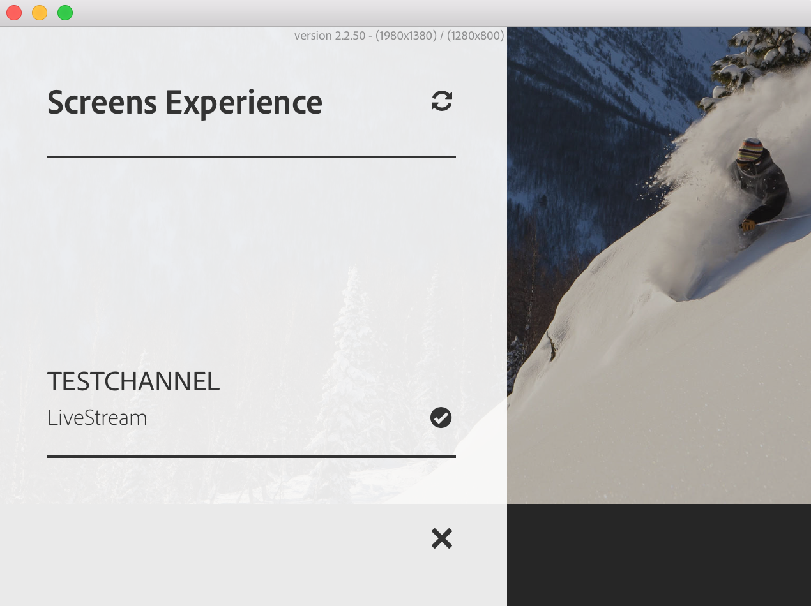

# AEM Screens Player での作業

AEM Screens Player でチャネルコンテンツなどの設定を管理できます。

>[!NOTE]
>
>押す ***Ctrl + Cmd + F*** os X AEM Screens Player のフルスクリーンモードを終了できます。

ディスプレイにチャネルを割り当てると、AEM Screens Player にコンテンツが表示されます。 管理 UI の環境設定を使用して（ダッシュボードから）、またはプレーヤー自体から、プレーヤーの設定を指定できます。

## デバイスダッシュボードの使用 {#using-the-device-dashboard}

AEM オーサリングインスタンスを介してアクセスできる、デバイスダッシュボードからデバイスの環境設定を指定できます。

1. プロジェクトからデバイスダッシュボード（例：）に移動します。 ***プロジェクトのテスト*** > ***デバイス***.

   クリック **デバイス** および **デバイスマネージャ** アクションバーから。

   

1. デバイスをクリックして、デバイスのダッシュボードを開きます。

   

1. **環境設定**&#x200B;パネルを確認します。オプションからプレーヤーの「**管理 UI**」と「**チャネルスイッチャー**」の有効／無効を切り替えることができます。

   

### 管理 UI {#the-admin-ui}

環境設定パネルから「**管理 UI**」を有効にすると、ユーザーは Screens Player から管理者設定を開くことができます。また、デバイスダッシュボードからこのオプションを無効にすると、ユーザーはプレーヤーから管理 UI を開くことができなくなります。

Screens Player から管理 UI を表示するには、左上隅を長押しして、タッチ操作対応AEM Screens Player またはマウスを使用して「管理」メニューを開きます。 登録が完了し、チャネルが読み込まれると、情報が表示されます。

>[!NOTE]
>
>また、AEM Screens Player アプリの稼動時間を表示して、アプリの正常性のステータスを確認することもできます。

#### 設定メニューオプションへのアクセス {#configuration-options}

をクリックすると、設定を更新できます **設定** サイドメニューのオプションを選択します（下図を参照）。

設定メニューを使用すると、次の設定を変更できます。

* このダイアログボックスから、**ファームウェア**、**環境設定**、または&#x200B;**デフォルト設定**&#x200B;をリセットします。

* AEM Screens Player に保持する最大ログファイル数を指定します **最大数 最大数**」で指定します。

* Screens プレーヤーの&#x200B;**管理者メニュー**、**チャネル切り替え**、**アクティビティ UI** を有効または無効にします。

  次の場合 **アクティビティ UI** はから有効になっています **設定** AEM Screens Player には、 *プレーヤーアクティビティの通知* 次の図に示すように、プレーヤーの右上隅にあります。

  

>[!NOTE]
>
>この **ファームウェアの更新** オプションは、Android™ プレーヤーなどの Cordova でのみ機能します。

>[!NOTE]
>
>実稼動デプロイメントでは&#x200B;**管理 UI** を無効にすることをお勧めします。

#### コンテンツキャッシュメニューオプションへのアクセス {#content-cache-options}

AEM Screens Player の管理 UI から、チャネルおよびアプリケーションのキャッシュをクリアできます。

「」をクリックします **コンテンツキャッシュ** サイドパネルからキャッシュを更新できます。

### チャネルスイッチャー {#the-channel-switcher}

環境設定パネルから「**チャネルスイッチャー**」を有効にすると、Screens Player からチャネル選択／設定を開くことができます。

また、デバイスダッシュボードでこのオプションを無効にすると、ユーザーは Screens Player でチャネル環境設定を制御できなくなります。

Screens Player からチャネルの設定を切り替えて制御できます。

プレーヤーからチャネルスイッチャーを表示するには、左下隅を長押しして、チャネルやその他の機能を切り替えられるチャネルスイッチャーを開きます。

>[!NOTE]
>
>また、Screens Player から、プレーヤーの管理メニューとチャネルスイッチャーを有効または無効にすることもできます。
>
>（詳しくは、 *Screens Player からの環境設定の変更* 以下の節で説明します）。

### AEM Screens Player からの環境設定の管理

プレーヤー自体からも Admin UI およびチャネルスイッチャーの設定を変更できます。

プレーヤーから環境設定を変更するには：

1. アイドルチャネルの左上隅のを長押しして、管理パネルを開きます。
1. 左のアクションメニューから&#x200B;**設定**&#x200B;に移動します。
1. **Admin UI** または&#x200B;**チャネルスイッチャー**&#x200B;の設定の有効／無効を切り替えます。

## AEM Screens Player のトラブルシューティング

AEM Screens Player に関係する様々な問題をトラブルシューティングすることができます。

| **問題** | **レコメンデーション** |
|---|---|
| プレーヤーのストレージがいっぱいです | 不要なファイルを削除してください |
| プレーヤーのネットワーク接続が途切れました | Cat-5/Cat-6 ケーブルを使用してください。Wi-Fi の場合は、ルーターからプレーヤーデバイスまでの距離を短くしてください |
| AEM Screens Player がクラッシュしました | AEM Screens Player が常時動作しているようにウォッチドッグアプリを使用することをお勧めします |
| AEM Screens Player の設定がなくなりました | AEM サーバーへの接続を確認してください |
| AEM Screens Player が再起動後に自動起動しません | OS のスタートフォルダーまたは初期化手順を確認してください |
| AEM Screens Player のコンテンツ表示が間違っていたり古かったりします | ネットワーク接続を確認してください |

### AEM Screens Player のアップデート

AEM Screens Player には、次の 2 とおりの更新方法があります。

| **方法** | **詳細** | **リモート経由** | **自動** | **ダウンタイムなし** |
|---|---|---|---|---|
| ファームウェアの更新 | リモートコマンドを使用して、既存のインストール済みプレーヤーに適用されます。 更新後、プレーヤーは既存のコンテンツで自動リロードされます。 | はい | カスタム | ほぼ 1～3 秒 |
| プレーヤーシェルの更新 | これは、プレーヤーにデプロイされる新しい実行可能ファイルです。これには、プレーヤーの新しいバイナリをリモートコピーし、現在実行中のを停止して、新しいバージョンを起動する必要があります。 パッケージのプリロードを再度ダウンロードする必要が生じる場合があります。 | 可（リモートシェル経由） | カスタム | いいえ |

## プレーヤーデバイスのハードウェア選定ガイドライン {#hardware-selection-guidelines-for-player-device}

この節では、Screens プロジェクトのハードウェア選定ガイドラインを示します。

* PC プレーヤーにもディスプレイパネルまたはプロジェクターにも、常に&#x200B;***商用***&#x200B;または&#x200B;***工業用***&#x200B;クラスのコンポーネントを調達します。

* デジタルサイネージマーケットに商品を提供しているベンダーと常に連携します。
* 周囲の気温や相対湿度などの環境要因を常に考慮に入れます。
* 電源要件と電力調整を常に確認します。
* パフォーマンスのニーズとアプリケーションに必要な I/O ポートを慎重に確認します。

AEM Screens プロジェクトの典型的な使用例に対応するハードウェア構成を次の表にまとめます。

<table>
 <tbody>
  <tr>
   <td>プレーヤー設定</td>
   <td>プロセッサー</td>
   <td>メモリ</td>
   <td>ストレージ SSD</td>
   <td>GPU</td>
   <td>ディスプレイ</td>
   <td>I/O</td>
   <td>典型的な使用例</td>
  </tr>
  <tr>
   <td>基本</td>
   <td>デュアルコア、i3、またはエントリーレベルのクアッドコア インテル® Atom プロセッサー</td>
   <td>
4 GB のメモリ
 
2 MB のキャッシュ
 </td>
   <td>
*ChromeOS 32 GB
 
*Windows 128 GB
 </td>
   <td>オンボード</td>
   <td>1920 x 1080</td>
   <td>DVI  イーサネット/ワイヤレス  USB x 2</td>
   <td>
    <ul>
     <li>標準フルスクリーンループ  </li>
     <li>日分割</li>
    </ul> </td>
  </tr>
  <tr>
   <td>標準</td>
   <td>クアッドコア、インテル® Core™ i5 プロセッサー</td>
   <td>
8 GB のメモリ
 
4 MB のキャッシュ
 </td>
   <td>128 GB</td>
   <td>オンボード</td>
   <td>3840x2160 （<code>4K</code>）</td>
   <td>DVI、HDMI  イーサネット／ワイヤレス、 USB x 2</td>
   <td>
    <ul>
     <li>単一ソースの動的コンテンツ</li>
     <li>シンプルインタラクティブ</li>
     <li>1～3 ゾーンレイアウト</li>
    </ul> </td>
  </tr>
  <tr>
   <td>アドバンス</td>
   <td>クアッドコア、ハイパースレッディング対応、インテル® Core™ i7 プロセッサー</td>
   <td>
16 GB のメモリ
 
8 MB のキャッシュ
 </td>
   <td>256 GB</td>
   <td>専用グラフィック GPU</td>
   <td>3840x2160 （<code>4K</code>）</td>
   <td>DVI、HDMI  イーサネット／ワイヤレス、 USB x 4</td>
   <td>
    <ul>
     <li>4 つ以上のコンテンツゾーン、同時ビデオ再生</li>
     <li>複数ページインタラクティブ</li>
     <li>複数ソースデータトリガー</li>
    </ul> </td>
  </tr>
 </tbody>
</table>
